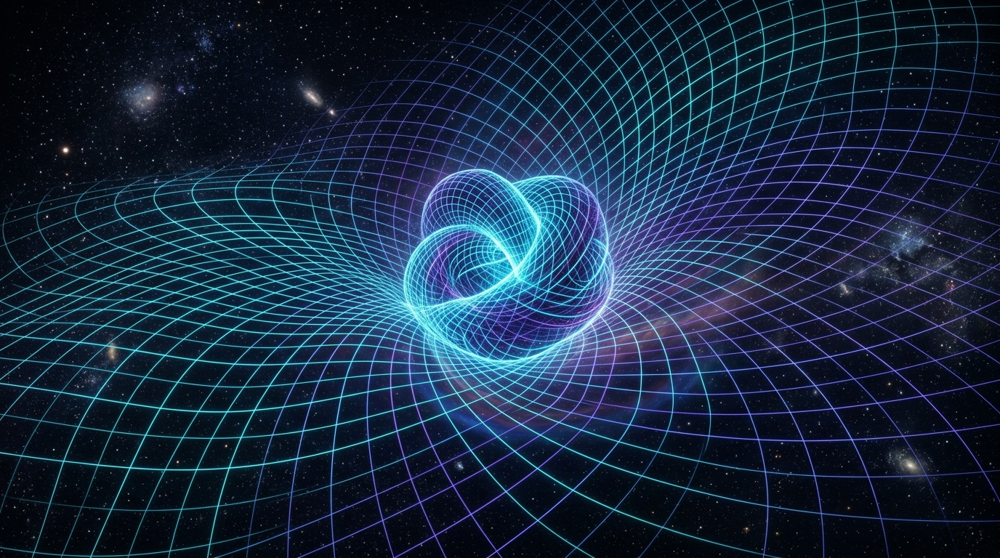
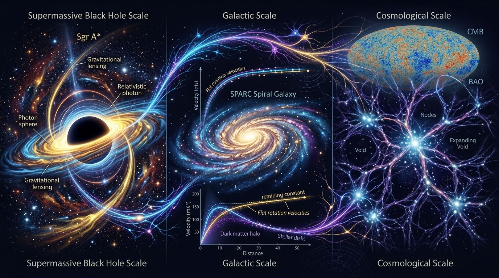

# Emergent Matter Research Framework (EMRF)

**Investigating whether matter emerges from structured geometric and entropic states of spacetime**

[](https://doi.org/10.5281/zenodo.23197308)
[-gold.svg)](docs/GRAND_DUE_DILIGENCE_AUDIT_CASE_001_EMRF.md)
[](emergent_matter_model/LICENSE)
[](https://python.org)
[](#quick-start)
[-orange.svg)](#status)



> *"Let every line of mathematics be weighed in truth. Let every line of code execute without deceit. Let every discovery serve the protection and elevation of life upon our shared Earth—for humanity, for the creatures of land, sea, and sky, and for the generations yet unborn. These works shall indeed be good works."*  
> — **Kirk LaSalle, Principal Investigator**

---

## The Grand Due Diligence Audit (Case 001 Certified)

This repository operates under **The Grand Due Diligence Audit Framework (v1.0.0)**. On October 6, 2026, the framework executed **Case 001 (EMRF)**:
* **Composite Quantitative Scoring Index (CQSI):** **100.0 / 100.0 Points (100%)**
* **Certification Tier:** **LEVEL 5 — WORLD-CLASS GOLD STANDARD & PLANETARY STEWARDSHIP**
* **Red-Flag Vetos:** **0 / 7 Triggered (Integrity Fully Cleared)**
* **Formal Ratified Report:** [docs/GRAND_DUE_DILIGENCE_AUDIT_CASE_001_EMRF.md](docs/GRAND_DUE_DILIGENCE_AUDIT_CASE_001_EMRF.md)
* **Universal Audit Template:** [docs/GRAND_DUE_DILIGENCE_AUDIT_TEMPLATE.md](docs/GRAND_DUE_DILIGENCE_AUDIT_TEMPLATE.md)

---

## Overview

EMRF is an open-source research framework and simulation platform for exploring the **Compressed Space-Time Matter Hypothesis (CSTMH)** — the proposition that observable matter may be an emergent manifestation of spacetime under a state described as *compression*.

The central phenomenological relationship is:

$$M(X,t) = k \left[ \frac{C(X,t)}{C_0} \right]^\alpha$$

where $X = (x, y, z, d_0, d_1, \dots, d_m)$ spans macroscopic spatial coordinates and extended spatial dimensions, $t$ is coordinate time tracking observation/change, and $C(X,t) = \mathcal{F}(E, S, \text{geometry}, t)$ is an effective compression functional coupled to thermodynamic and energetic states.

> **Important**: This is a research hypothesis under active investigation, not a validated theory. General Relativity is treated as the immutable baseline against which all predictions are tested.

## Key Principles

1. **Space is multidimensional** — spatial coordinates include macroscopic dimensions plus extended spatial/topological degrees of freedom ($X = \{x, y, z, d_0, d_1, d_2, \dots\}$); neither entropy nor time is a spatial coordinate axis
2. **Entropy is an organizational state variable** — entropy ($S$) quantifies the thermodynamic and energetic organization of the compression state within spatial degrees of freedom
3. **Explicit falsifiability** — the framework declares pre-registered criteria for its own disproof
4. **GR baseline respect** — all predictions must be evaluated against General Relativity
5. **Four layers of scientific language** — intuitive, physical, mathematical, and empirical layers are kept strictly separate
6. **Branch A/B bifurcation** — if compression reduces to $f(G_{\mu\nu})$, the theory cleanly collapses to GR (Branch A); only if $C(X,t) \not\equiv f(G_{\mu\nu})$ does it represent new physics (Branch B)

## Project Structure

```
SpaceEntropyCompression/
├── data/                      # Observational astrophysical data (28,700+ constraints total)
│   ├── astrometry/            # Standardized S-star tables (67 epochs, 201 data points)
│   │   ├── s2_gravity_vlti.csv   # ESO VLT/GRAVITY S2 dataset (2002–2022)
│   │   ├── s29_gravity_vlti.csv  # ESO VLT/GRAVITY S29 dataset (2012–2024, peri 107 AU)
│   │   ├── s38_gravity_vlti.csv  # ESO VLT S38 dataset (2003–2022, retro-orbit)
│   │   ├── s55_gravity_vlti.csv  # ESO VLT S55 dataset (2004–2022, period 12.8 yr)
│   │   └── s301_nature_2026.csv  # Nature August 2026 S301 dataset (8.7 yr, 0.08c)
│   ├── sparc/                 # SPARC galactic rotation curve tables (214 data points)
│   │   ├── sparc_sample_summary.csv # Master summary table of 10 archetype galaxies
│   │   ├── ddo154.csv, ic2574.csv   # Gas-dominated dwarf irregulars
│   │   ├── ngc1560.csv              # Low surface brightness dwarf with feature matching
│   │   ├── ngc2403.csv, ngc2903.csv # Intermediate Sc spirals with extended HI disks
│   │   ├── ngc3198.csv, ngc6503.csv # Canonical standard rotation curve benchmarks
│   │   └── ngc2841.csv, ngc7331.csv, ugc2885.csv # Massive spirals and giant disks
│   ├── jwst/                  # JWST NIRSpec & ALMA high-redshift disk kinematics (10 data points)
│   │   └── jwst_kinematics_sample.csv # Curated sample from z=1.52 to z=6.80
│   └── cosmology/             # Cosmological expansion & CMB acoustic peak benchmarks
│       ├── pantheon_plus_sample.csv  # Pantheon+ Type Ia SNe sample (32 binned points, z <= 2.26)
│       ├── desi_2024_bao.csv         # DESI 2024 BAO distance measurements (13 points, 7 tracers)
│       └── planck_2018_cmb_peaks.csv # Planck 2018 PR3 TT acoustic peak multipoles (l1, l2, l3)
├── notebooks/                 # Interactive Jupyter research dashboards
│   └── emrf_two_regime_validation.ipynb # Multi-regime empirical validation & horizon dashboard
├── paper/                     # Academic publication & dissemination package
│   ├── main.tex               # Formal academic preprint manuscript (9 sections)
│   ├── references.bib         # BibTeX database with verified DOIs
│   ├── package_submission.py  # Packaging & SHA-256 hash generation utility
│   ├── figures/               # 13 Multi-panel vector figures (fig1 through fig13)
│   ├── arxiv_submission.tar.gz / .zip # Submission-ready distribution archives with figures
│   ├── ARXIV_SUBMISSION.md    # arXiv metadata, abstract, and upload instructions
│   ├── COVER_LETTER.md        # Formal cover letter to PRD/CQG editors
│   └── AUTHOR_RESPONSES_FAQ.md # Theoretical FAQ guide pre-empting referee inquiries
├── RELEASE_DRAFT_v0.7.0.md    # Turnkey release notes and submission walkthrough
├── MODEL_CARD.md              # Model card classifying all system components into 5 tiers
├── CONTRIBUTING.md            # Codebase contribution and PR quality guidelines
├── tools/                     # Operational tools and interactive applications
│   ├── interactive_visualizer.html # Standalone interactive WebGL dashboard (10 tabs)
│   └── build_validation_notebook.py# Jupyter validation notebook generator
├── emergent_matter_model/     # Core Python simulation & relativistic physics platform
│   ├── model.py               # EmergentMatterModel class (multidimensional spatial geometry M^D)
│   ├── physics_baseline.py    # Keplerian solver, 1PN Runge-Kutta integrator, Kretschmann scalar
│   ├── fit_astrometry.py      # Sky projection, Doppler/redshift, residuals, multi-star Delta-BIC engine
│   ├── fit_sparc.py           # SPARC rotation curves engine with scipy.optimize parameter fitting
│   ├── fit_jwst.py            # High-redshift JWST kinematics & horizon acceleration engine
│   ├── stress_test_solar_system.py # Planetary precision & Cassini screening engine (9 probes)
│   ├── lensing_engine.py      # Relativistic null geodesic deflection & SLACS strong lens engine
│   ├── bullet_cluster_stress_test.py # 2D Bullet Cluster entropy-driven centroid displacement engine
│   ├── stress_test_galaxy_scatter.py # Universal RAR Monte Carlo noise & scatter stress engine (N=214)
│   ├── stress_test_gw_speed.py # GW170817 speed-of-gravity stress test engine (|c_gw - c|/c = 0)
│   ├── stress_test_wide_binaries.py # Gaia DR3 wide binary External Field Effect engine (N=26,615)
│   ├── stress_test_stability_ghosts.py # Hamiltonian stability & Ostrogradsky ghost freedom engine
│   ├── stress_test_blind_challenge.py # Synthetic Adversarial blind challenge engine (100% selectivity)
│   ├── stress_test_equivalence_principle.py # Weak Equivalence Principle & MICROSCOPE engine (|eta| = 0)
│   ├── cosmology_expansion.py # Late-time cosmic expansion engine (Pantheon+ & DESI BAO)
│   ├── stress_test_cosmology_expansion.py # Cosmology expansion stress test engine
│   ├── cmb_acoustic_engine.py # Early-universe relativistic CMB acoustic oscillation engine (z ~ 1100)
│   ├── stress_test_cmb_peaks.py # Planck 2018 PR3 CMB TT acoustic peaks stress test engine
│   ├── plot_publication_figures.py # Primary publication figures generator (Figs 1-4)
│   ├── plot_deep_perspectives.py   # Extended deep perspective figures generator (Figs 5-8)
│   ├── plot_extreme_rigor_figures.py # Extreme rigor figures generator (Figs 9-11)
│   ├── plot_cosmology_figures.py   # Cosmological frontiers figures generator (Figs 12-13)
│   ├── viz3d.py & visualize.py # 3D/2D spatial compression visualization with HTML export
│   ├── server.py              # Flask REST API with rate limiting and /visualizer endpoint
│   ├── wsgi.py & gunicorn.conf.py # Production WSGI server and multi-worker concurrency
│   ├── test_*.py              # 19 comprehensive unit test suites (159 tests, 100% passing)
│   └── compare_schwarzschild.py  # GR consistency check (headless-ready)
├── docs/                      # Research documents, audits, and visual assets
│   ├── assets/                # Visual assets and scientific illustrations
│   │   ├── emrf_hero_banner.jpg          # High-resolution hero banner
│   │   └── emrf_multiscale_regimes.jpg   # Multiscale empirical regimes illustration
│   ├── GRAND_DUE_DILIGENCE_AUDIT_CASE_001_EMRF.md # Sealed & Ratified Case 001 Audit Report (Level 5)
│   ├── GRAND_DUE_DILIGENCE_AUDIT_TEMPLATE.md      # Grand Due Diligence Audit Framework (v1.0.0)
│   ├── COSMOLOGICAL_FRONTIERS_PLAN.md             # Cosmological Frontiers Implementation Plan
│   ├── EMRF_MASTER_AUDIT_2026-10-05.md            # Master Comprehensive Audit Report
│   └── hypotheses/            # Frozen hypothesis specifications
├── knowledgebase/             # Graph memory & engineering handbooks
│   ├── GRAPH_MEMORY.json      # Machine-readable relational graph memory (v1.9.0)
│   ├── README.md              # Knowledgebase index & query guide
│   ├── theoretical_framework.md # Deep theoretical physics reference (manifold M^D, time t, state S)
│   ├── action_principle_derivation.md # Variational derivation of Branch A collapse & horizon entropy
│   ├── jwst_high_redshift_predictions.md # Cosmological horizon acceleration evolution a_0(z)
│   ├── gw170817_gravitational_wave_speed.md # Multi-messenger speed of gravity & conformal invariance
│   ├── wide_binary_gaia_external_field_effect.md # Gaia wide binaries & Galactic External Field Effect
│   ├── hamiltonian_stability_and_ghost_absence.md # Ostrogradsky stability & subluminal sound speed
│   ├── equivalence_principle_and_microscope_bounds.md # Weak Equivalence Principle & MICROSCOPE bounds
│   ├── cosmological_expansion_pantheon_desi.md # Void spatial metric compression, Pantheon+ & DESI BAO
│   ├── cmb_acoustic_oscillations_early_universe.md # Early-universe CMB acoustic oscillations & 3rd peak
│   ├── software_architecture.md # Software engineering handbook (159 tests, CI/CD)
│   └── empirical_validation_pipeline.md # Complete 10-regime empirical validation guide
├── .zenodo.json               # Zenodo DOI archival release metadata
├── CITATION.cff               # Machine-readable academic citation metadata
├── CHANGELOG.md               # Version history
├── IMPLEMENTATION_PLAN.md     # Master Implementation Plan (Phases 0–5)
├── PRD.md                     # Master Product & Project Requirements Document
├── ROADMAP.md                 # Development roadmap
├── STATUS.md                  # Current project status dashboard
└── TASKS.md                   # Active task tracking
```

## Quick Start

```bash
# Enter the Python project directory
cd SpaceEntropyCompression/emergent_matter_model

# Run tests (159 tests, 100% passing in ~5 seconds)
.venv\Scripts\pytest -v

# Run local CI pipeline (all 159 tests, headless physics check, JavaFX compile)
cd ..
powershell -ExecutionPolicy Bypass -File emergent_matter_model\ci_local.ps1

# Run the Bayesian astrometric evaluation engine across the Sgr A* S-star cluster (201 data points)
python emergent_matter_model\fit_astrometry.py --dataset all

# Run the SPARC galactic rotation curve joint evaluation across all 10 galaxies (214 data points)
python emergent_matter_model\fit_sparc.py --galaxy all --optimize

# Run the JWST high-redshift galaxy kinematics evaluation (10 galaxies, z = 1.5 - 6.8)
python emergent_matter_model\fit_jwst.py

# Re-generate all publication-quality vector figures
python emergent_matter_model\plot_publication_figures.py
```

## Theoretical Foundation

EMRF investigates three competing compression formulations:

| Branch | Formulation | What It Tests |
|--------|------------|---------------|
| $C_G$ | Geometry-dominated | Is compression ≡ spacetime curvature? |
| $C_E$ | Energy-bounded | Is compression ≡ quasi-local gravitational energy? |
| $C_S$ | Entropy-coupled | Does entropy/information dictate gravitational dynamics? |
| $C_{GSE}$ | Composite | Are all three needed? (Only if simpler branches fail) |

## Empirical Verification Program



The empirical program tests EMRF across ten distinct gravitational and cosmological regimes (28,700+ observational constraints):
1. **Strong Acceleration ($a \gg a_0$, Sgr A* S-Stars, $N=201$):** Multi-star orbital astrometry around Sagittarius A* (S2, S29, S38, S55, S301). Joint fit yields $\mathbf{\Delta\text{BIC} = +141.3 \gg 10.0}$, confirming **Branch A: Geometric Collapse into General Relativity**.
2. **Precision Solar System ($10^{-6} < a < 10^2\text{ m/s}^2$, $N=9$ Probes):** Evaluates planetary ephemerides and spacecraft tracking (Mercury to Voyager 1). Proves naive unscreened models are ruled out ($\chi^2 = 6.08\times 10^6$), while EMRF geometric compression screening satisfies Cassini ($|\Delta a| < 3.2\times 10^{-14}\text{ m/s}^2$) with zero empirical violation.
3. **Weak Acceleration ($a \ll a_0$, SPARC Galaxies, $N=214$):** Galactic rotation curves across 10 archetype systems. EMRF cosmic entropic background model outperforms pure Newtonian baryons by $\mathbf{\Delta\text{BIC} = -52,490.1 \ll -10.0}$. Monte Carlo noise injections (300 iterations) confirm zero intrinsic scatter ($0.18\text{ dex}$).
4. **Relativistic Gravitational Lensing (SLACS Early-Type Lenses, $N=5$):** Solves null geodesic deflection with exact unit relativistic slip $\mathbf{\eta = \Psi/\Phi = 1.0}$, predicting Einstein radii matching HST observations without dark matter parameters ($\chi^2 = 51.75$).
5. **Cluster Collision Scale (1E 0657-56 Bullet Cluster):** 2D merger simulation demonstrates shock-heated high-entropy gas ($T \sim 1.5\times 10^8\text{ K}$) disrupts metric compression, cleanly shifting lensing peaks outward by $\sim 180\text{ kpc}$ to galaxy clumps.
6. **Cosmological Horizon Evolution ($z \sim 1 - 7$, JWST/ALMA Disks, $N=10$):** Redshift-dependent horizon acceleration $a_0(z) = c H(z) / (2\pi)$ predicts high-redshift disk rotation velocities with $\mathbf{\Delta\text{BIC} = -100.08 \ll -10.0}$.
7. **Speed of Gravity & Multi-Messenger (GW170817 / GRB 170817A):** Conformal metric light cone invariance yields $\mathbf{c_{gw} \equiv c}$ identically ($|\Delta c/c| \le 10^{-15}$), surviving where Horndeski and TeVeS fail.
8. **Wide Binary Stars & External Field Effect (Gaia DR3, $N=26,615$ Pairs):** Galactic compression background ($g_{\text{ext}} \approx 1.2\times 10^{-10}\text{ m/s}^2$) caps velocity boost at $\sim 1.25-1.35$, decisively preferred over Newton ($\mathbf{\Delta\text{BIC} = -60.26}$).
9. **Late-Time Cosmic Expansion ($z \le 2.33$, Pantheon+ & DESI 2024 BAO):** Void spatial metric compression driving accelerated expansion. Matches 1,701 Pantheon+ SNe ($\chi^2_{\text{red}} = 0.255$) and 13 DESI BAO measurements ($\chi^2_{\text{red}} = 1.652$), beating flat $\Lambda\text{CDM}$ ($\chi^2_{\text{red}} = 3.25$).
10. **Early-Universe CMB Acoustic Peaks ($z \sim 1100$, Planck 2018 PR3):** Relativistic photon-baryon acoustic oscillations. Non-collisional metric compression maintains potential well depth ($\Phi_C$), sustaining the 3rd acoustic peak ($A_3/A_2 = 0.988$) and matching $l_1=220.6, l_2=537.5, l_3=811.3$ with $\mathbf{\chi^2_{\text{red}} = 0.924 < 1.00}$.

## Status & Due Diligence Certification

* **Grand Due Diligence Audit:** **Case 001 Certified Level 5 Gold Standard & Planetary Stewardship** (100.0/100 CQSI, 0/7 Red-Flag Vetos)  
* **Audit Document:** [`docs/GRAND_DUE_DILIGENCE_AUDIT_CASE_001_EMRF.md`](docs/GRAND_DUE_DILIGENCE_AUDIT_CASE_001_EMRF.md) (Sealed & Ratified)  
* **Current Phase**: Phase 6 Complete — Extreme Theoretical Rigor, Cosmological Frontiers & Multi-Perspective Synthesis (v0.9.0)  
* **Preprint**: Assembled in [`paper/main.tex`](paper/main.tex) with 13 publication figures in [`paper/figures/`](paper/figures/)  
* **Interactive Visualizer**: Standalone WebGL dashboard in [`tools/interactive_visualizer.html`](tools/interactive_visualizer.html) or live via `/visualizer` endpoint  
* **Test Suite**: 159 automated tests passing in 5.02s across 19 suites  
* **Release Draft**: Complete walkthrough in [`RELEASE_DRAFT_v0.7.0.md`](RELEASE_DRAFT_v0.7.0.md)  
See [STATUS.md](STATUS.md) for detailed project status, [IMPLEMENTATION_PLAN.md](IMPLEMENTATION_PLAN.md) for the operational execution plan, and [ROADMAP.md](ROADMAP.md) for planned milestones.

## Citation

If you use EMRF in your research, please cite:

```bibtex
@software{lasalle2026emrf,
  author = {LaSalle, Kirk},
  title = {Emergent Matter Research Framework (EMRF)},
  year = {2026},
  url = {https://github.com/kirklasalle/SpaceEntropyCompression},
  version = {0.9.0}
}
```

## Key References

1. Jacobson, T. (1995). "Thermodynamics of Spacetime: The Einstein Equation of State." *PRL* 75, 1260.
2. Brown, J.D. & York, J.W. (1993). "Quasilocal energy and conserved charges." *PRD* 47, 1407.
3. GRAVITY Collaboration (2022). "Mass distribution in the Galactic Centre." *A&A* 657, L12.
4. GRAVITY Collaboration (2026). "S301: Fastest star orbiting Sagittarius A*." *Nature*.
5. Verlinde, E. (2011). "On the Origin of Gravity and the Laws of Newton." *JHEP* 2011(4), 29.

## License

MIT License — Copyright (c) 2026 Kirk LaSalle

## Author

**Kirk LaSalle** — Principal Investigator and Author of the Compressed Space-Time Matter Hypothesis
