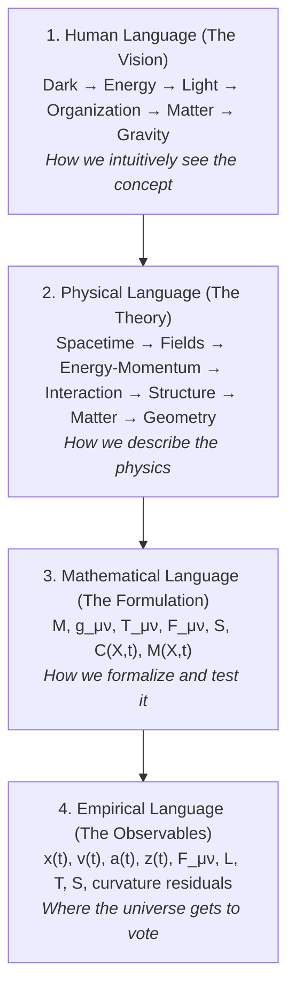
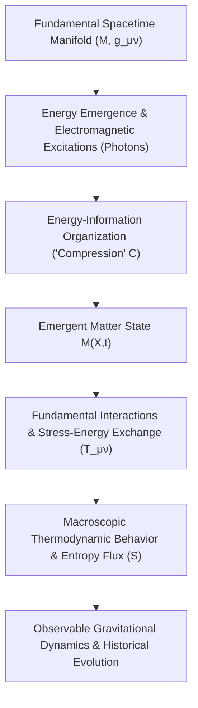
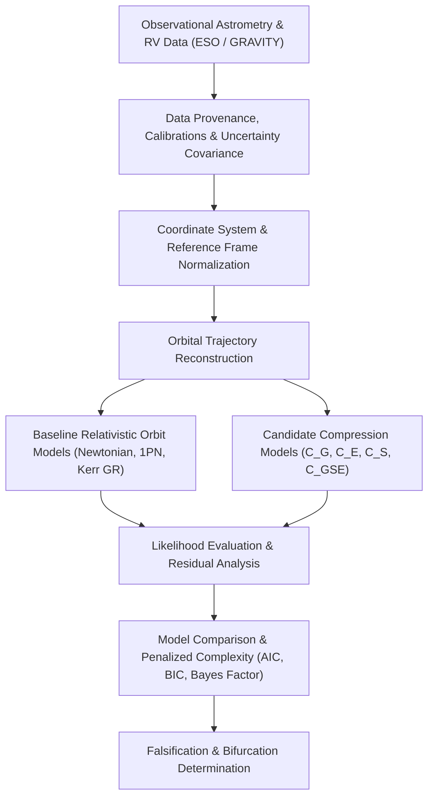

# Emergent Matter Research Framework (EMRF)

## Comprehensive Research Audit, Mathematical Status Review, and Empirical Research Program

**Document Status:** Working Research Document — September 2026  
**Primary Hypothesis:** Compressed Space-Time Matter Hypothesis (CSTMH)  
**Project Location:** `D:\Projects\theory\SpaceEntropyCompression`  
**Theoretical Architecture:** Geometric, Gravitational-Energy, and Entropic Compression Formulations ($C_G$, $C_E$, $C_S$, $C_{GSE}$)  
**Sidebar Hypothesis Extension:** Temporal Emergence, Energy-EM-Matter-Gravity Chain, Unidentified Mass-Energy $U(X,t)$, and Cosmological Scale Hierarchy

> **Audit note (2026-09-30):** This working paper is a hypothesis specification and research program. The repository implementation currently provides a phenomenological grid simulator, not a relativistic field solver or observational orbital-fit engine. See `Documents/EMRF_Audit_and_Project_State_Report_2026-09-30.md` for the independent audit and `Documents/EMRF_Reference_Matrix_2026-09-30.csv` for the source matrix.

---

## Document Status and Scientific Position

This document consolidates the current conceptual, mathematical, computational, and empirical research program developed within the Emergent Matter Research Framework (EMRF). It is intentionally structured as a critical research document rather than an unverified assertion of physical truth. The central hypothesis remains provisional. Established physics—specifically General Relativity, quantum field theory, and relativistic thermodynamics—is treated as the immutable baseline against which all new predictions must be evaluated.

The strongest current formulation posits that matter may be an emergent manifestation of spacetime under a state described, at the meta level, as **compression**. "Compression" is not assumed *a priori* to be a single primitive scalar or a novel fundamental force. Rather, it represents a top-down descriptor whose exact mathematical realization is the central unsolved problem of this research program. The current investigation examines whether spacetime geometry, rigorously formulated gravitational energy measures, and well-defined entropy/information measures jointly characterize that state.

Crucially, EMRF adheres to strict academic and epistemological precision. Colloquial assertions such as *"Gravity is energy"* are explicitly rejected in the formal theory. Instead, the framework adopts the following foundational proposition:

> **Formal EMRF Research Baseline:**  
> *EMRF investigates whether gravitational phenomena can be represented as an energetic/geometric state and whether the proposed compression variable provides a mathematically invariant description of that state.*

This academic posture is significantly stronger because it gives nature the uninhibited opportunity to tell us we are wrong, establishing a strict falsification protocol grounded in empirical astrophysics.

---

## Executive Summary

The EMRF project has evolved from a conceptual inquiry regarding compressed spacetime into a formal multidisciplinary research framework combining differential geometry, gravitation, thermodynamics, astrophysical observations, numerical simulation, symbolic mathematics, and rigorous model selection.

The working phenomenological relationship developed in the project is:

$$M(X,t) = k \left[ \frac{C(X,t)}{C_0} \right]^\alpha$$

Where:

- $M(X,t)$ denotes an emergent matter-density or matter-state observable;
- $C(X,t)$ denotes the as-yet-to-be-derived compression descriptor;
- $C_0$ is a reference state normalization ensuring dimensional consistency;
- $k$ is a physical scale factor;
- $\alpha$ is a dimensionless scaling exponent.

This equation is currently a phenomenological scaling ansatz, not yet a first-principles derivation from Einstein-Hilbert action principles, quantum field theory, or non-equilibrium thermodynamics.

A primary conceptual refinement is that $X$ is not restricted to ordinary three-dimensional spatial coordinates $\mathbf{x} \in \mathbb{R}^3$. It is formulated as an extended generalized state coordinate:

$$X = \{x, y, z, d_1, d_2, \dots, d_n\}$$

capable of representing ordinary spatial location together with additional dimensional or internal state degrees of freedom on an extended manifold or fiber bundle.

The empirical verification program is intended to be anchored on real stellar astrometry and spectroscopy in the Galactic Center, where multiple stars orbit the supermassive black hole Sagittarius A*. Public data from the European Southern Observatory (ESO) Science Archive and published datasets from the GRAVITY/VLTI collaboration provide a strong observational baseline. In particular, the 2022 GRAVITY multi-star analysis of **S2, S29, S38, and S55** offers an exceptional strong-field laboratory for rigorous model comparison against General Relativity. The current repository does not yet ingest those data or perform that comparison.

Furthermore, via a dedicated theoretical sidebar extension (archived in Section 16), EMRF incorporates the temporal emergence hypothesis:

$$\boxed{ \text{Spacetime} \longrightarrow \text{Energy} \longrightarrow \text{Field organization} \longrightarrow \text{Compression} \longrightarrow \text{Matter} \longrightarrow \text{Emergent Gravity} }$$

where compression $C(X,t) = \mathcal{F}(E, S, \text{geometry}, t)$ is recognized as the state variable describing the increasing organization of energy-momentum within spacetime degrees of freedom over time across a five-tier Cosmological Scale Hierarchy.

---

## 1. Research Context and Origin

The project originated from a foundational physical question: should matter be regarded as an irreducible fundamental entity, or could matter emerge from a structured geometric/energetic state of spacetime? The working hypothesis treats matter as an emergent manifestation associated with a sufficiently intense or topological state of spacetime.

The term **"compression"** is deliberately deployed as a meta-level conceptual and visual descriptor. The project does not conflate compression with any single classical quantity (such as trace curvature, matter pressure, or volumetric strain). Instead, the computational program is designed to test whether a coordinate-invariant compression functional can be constructed from observable or derivable geometric and thermodynamic quantities.

### 1.1 The Four Layers of Scientific Language

EMRF recognizes that in the frontier development of physical theory, researchers develop a conceptual vocabulary before the underlying mathematics has fully stabilized. To prevent confusion between metaphor and proof, EMRF establishes a rigid boundary across four distinct layers of language:



1. **Human Language (Visual Model):** The intuitive vision: $\text{Dark} \to \text{Energy} \to \text{Light} \to \text{Organization} \to \text{Matter} \to \text{Gravity}$.
2. **Physical Language (Theoretical Description):** The physical mechanisms: $\text{spacetime} \to \text{fields} \to \text{energy-momentum} \to \text{interaction} \to \text{structure} \to \text{matter} \to \text{gravitational geometry}$.
3. **Mathematical Language (Formal Derivation):** Tensor calculus and differential geometry: $\mathcal{M}, g_{\mu\nu}, T_{\mu\nu}, F_{\mu\nu}, S, C(X,t), M(X,t)$.
4. **Empirical Language (Measurable Observables):** High-precision astrophysical data: $x(t), v(t), a(t), z(t), F_{\mu\nu}, L, T, S, \mathcal{I}_{\text{curv}}$.

### 1.2 Developing Nomenclature Ahead of Mathematical Stabilization: Building the Dictionary

A critical operational insight raised by the author is:
> *"I am deriving a language so I can describe it and know that you will have nomenclature."*

This is recognized as a legitimate and essential part of physical theory development:

- **Developing vocabulary for a physical hypothesis before the mathematics has completely stabilized** allows the conceptual framework to take shape without premature algebraic constraints.
- In this collaboration, the author provides the intuitive vision and evolving vocabulary, while the theoretical framework acts as the dictionary builder—formalizing terms, clarifying distinctions against established physics, and rigorously holding the scientific red pen when empirical evidence or mathematical consistency demands revision.
- Crucially, a hard boundary is maintained across all four stages: the **vocabulary**, the **hypothesis**, the **derivation**, and the **empirical result**.

---

## 2. Current Conceptual Hierarchy



The thermodynamic distinction in this hierarchy is paramount: **the project does not propose that entropy mechanically creates matter**. Macroscopic thermodynamics remains a downstream, observable consequence of matter and its field interactions. Concurrently, the framework investigates whether entropy or information measures (such as causal horizon entropy or entanglement entropy) participate as constitutive inputs to the fundamental compression functional at the geometric boundary.

---

## 3. Mathematical Core — Current Status

### 3.1 Working Matter Relation

$$M(X,t) = k \left[ \frac{C(X,t)}{C_0} \right]^\alpha$$

This relation serves as a phenomenological scaling ansatz. The ratio $C(X,t)/C_0$ renders the base dimensionless, allowing $\alpha$ to act as a pure critical scaling exponent. The physical units of $M$ and scale coefficient $k$ depend on whether $M$ is operationalized as:

1. Effective mass density $\rho_{\text{eff}}$ ($\text{kg}\cdot\text{m}^{-3}$);
2. Energy density $u$ ($\text{J}\cdot\text{m}^{-3}$);
3. Invariant matter-content functional $\mathcal{M}$ over a spacelike Cauchy hypersurface $\Sigma_t$.

### 3.2 Generalized State Coordinate

$$X = \{x, y, z, d_1, d_2, \dots, d_n\}$$

The coordinate $X$ embeds standard spatial coordinates within an $N$-dimensional configuration manifold $\mathcal{Q}$. In differential geometric terms, $X$ can be formalized as coordinates on a fiber bundle $E \xrightarrow{\pi} \mathcal{M}^4$, where the base space is Lorentzian spacetime and the fibers represent internal dimensional or thermodynamic state spaces.

### 3.3 Compression as a Derived Dynamic Functional & Nomenclature Clarification

$$C(X,t) \longrightarrow \mathcal{F}\left[ g_{\mu\nu}, R, R_{\mu\nu}, R_{\mu\nu\rho\sigma}, T_{\mu\nu}, S, E, t, \dots \right]$$

A vital mathematical and linguistic clarification is that "compression" does not denote mechanical pressure, volume reduction, or physical squeezing. Instead:

$$\boxed{ \textbf{Compression} = \text{the state of organized energy-momentum within spacetime} }$$

> **Provisional Working Definition:**  
> **Compression is a measurable state variable describing the increasing organization and concentration of energy-momentum within the degrees of freedom of spacetime over time.**

While "compression" is retained as the working term, prospective formal nomenclature includes **Spacetime Energy Organization (SEO)** or **Geometric Energy Organization (GEO)**.

Mathematically, compression is expressed as:

$$\boxed{ C(X,t) = \mathcal{F}(E, S, \text{geometry}, t) }$$

### 3.4 Space and Entropy

The conceptual proposition that "space and entropy define compression" is formalized not as an algebraic summation, but as a coupled functional:

$$C = \mathcal{F}\left( g_{\mu\nu}, S, \nabla_\mu S, \mathcal{I}_{\text{curv}}, T_{\mu\nu}, t \right)$$

The entropy variable $S$ cannot remain ambiguous. In physics, multiple distinct entropies exist:

- **Thermodynamic entropy:** $dS = \delta Q_{\text{rev}} / T$;
- **Statistical / Boltzmann entropy:** $S_B = k_B \ln \Omega$;
- **Gibbs / von Neumann quantum entropy:** $S_{\text{vN}} = -\text{Tr}(\rho \ln \rho)$;
- **Entanglement entropy across spatial bipartitions:** $S_A = -\text{Tr}(\rho_A \ln \rho_A)$;
- **Bekenstein-Hawking gravitational horizon entropy:** $S_{\text{BH}} = \frac{k_B c^3 A}{4 G \hbar}$.

Every concrete implementation of $C(X,t)$ must explicitly state which definition of $S$ is utilized and demonstrate its physical justification.

---

### 3.5 The Nature of Compression: Gravitational Geometry, Energy, and Entropy Formulations

A critical, foundational refinement of EMRF is that compression $C(X,t)$ must **never** be assumed *a priori* to represent an exotic, unverified fundamental force of nature. Postulating a new force without exhausting geometric and thermodynamic explanations violates Occam's razor and undermines physical defensibility.

Instead, the central theoretical question of EMRF is formalized as:

$$\boxed{ \text{Is } C(X,t) \text{ actually a new physical quantity, or is it a mathematical description of gravity?} }$$

To answer this question decisively, EMRF establishes an explicit branch of the research framework that formulates and tests three competing physical candidates against real observational data:

#### 1. Geometry-Dominated Compression ($C_G$)

$$C_G = f(\text{spacetime geometry})$$
In this formulation, compression is defined entirely as an invariant functional of Riemannian spacetime geometry. Candidate mathematical objects include:

- Curvature invariants: $R$, $R_{\mu\nu} R^{\mu\nu}$, or Kretschmann scalar $K = R^{\alpha\beta\gamma\delta} R_{\alpha\beta\gamma\delta}$;
- Geodesic convergence: Raychaudhuri expansion $\theta$ along timelike or null congruences;
- Weyl curvature conformal invariants $C_{\alpha\beta\gamma\delta} C^{\alpha\beta\gamma\delta}$.

If $C_G$ reproduces all empirical orbital observations and is mathematically reducible to the established geometric description under the same assumptions, then compression should be classified as a geometric reformulation of standard General Relativity. Orbital agreement alone does not prove that reduction.

#### 2. Physically Defensible Gravitational Energy Compression ($C_E$)

$$C_E = f(\text{physically defensible gravitational/energy measures})$$
In this formulation, compression is explored as a measure of gravitational energy. Because General Relativity strictly forbids a local, coordinate-independent stress-energy tensor for the gravitational field (detailed in Section 4.1), $C_E$ cannot employ coordinate-dependent pseudo-tensors. Instead, $C_E$ must be constructed from physically defensible **quasi-local energy measures** (e.g., Brown-York surface stress-energy, Hawking mass) or asymptotic invariants (ADM mass, Bondi-Sachs mass).

#### 3. Entropy and Information-Coupled Compression ($C_S$)

$$C_S = f(\text{entropy/information} + \text{geometry})$$
In this formulation, compression directly couples spacetime geometry with entropy flux, causal horizon area entropy, or entanglement entropy gradients. This formulation tests whether information-theoretic bounds directly dictate effective gravitational dynamics.

#### 4. Composite Formulation ($C_{GSE}$)

$$C_{GSE} = f(g_{\mu\nu}, \text{curvature}, E, S, t, \dots)$$
A composite formulation combining geometry, energy, and entropy is evaluated only if justified by the empirical failure of single-family models or if a fundamental theoretical derivation (such as Jacobson's thermodynamic equation of state) requires their coupled synthesis.

---

## 4. Relationship to Established Physics

### 4.1 The Gravitational Energy Localization Problem in General Relativity

A cornerstone of theoretical physics governs any attempt to treat gravity as an "energy state." In General Relativity, Einstein's field equations establish the exact coupling between geometry and matter:

$$G_{\mu\nu} \equiv R_{\mu\nu} - \frac{1}{2} R g_{\mu\nu} = \frac{8\pi G}{c^4} T_{\mu\nu}$$

Matter and non-gravitational fields possess a covariant, gauge-invariant stress-energy-momentum tensor $T_{\mu\nu}$ satisfying local covariant conservation $\nabla_\mu T^{\mu\nu} = 0$.

However, **in General Relativity, there is no universally accepted, coordinate-independent local tensor representing gravitational energy density**.

This is not an oversight or limitation of mathematics; it is an unavoidable consequence of the **Einstein Equivalence Principle**. According to the Equivalence Principle, in the infinitesimal neighborhood of any event $p \in \mathcal{M}$, one can always construct a local freely falling coordinate system (Riemann normal coordinates) such that:
$$g_{\mu\nu}(p) = \eta_{\mu\nu}, \quad \partial_\rho g_{\mu\nu}(p) = 0, \quad \Gamma^\mu_{\alpha\beta}(p) = 0$$

In this local frame, gravitational acceleration and the gravitational field vanish completely. Because a true tensor that vanishes in one coordinate system must vanish in all coordinate systems, and because gravity can always be transformed away locally, **no local tensorial energy density $t_{\mu\nu}$ can represent the gravitational field**.

Historical attempts to define gravitational energy density produced *pseudo-tensors* (e.g., Einstein, Landau-Lifshitz, Møller, Bergmann-Thomson). Crucially:

- Pseudo-tensors are non-tensorial and coordinate-dependent;
- By choosing appropriate coordinate charts, a pseudo-tensor can be made to take arbitrary, non-zero values in flat Minkowski space, or vanish identically in curved spacetime around a black hole;
- Consequently, pseudo-tensors possess no local gauge-invariant physical meaning.

In rigorous contemporary relativity, gravitational energy is well-defined only in two specific domains:

1. **Asymptotic Global Invariants:**
   - **ADM Mass ($M_{\text{ADM}}$):** Defined at spatial infinity $i^0$ for asymptotically flat Cauchy surfaces via Hamiltonian boundary integrals;
   - **Bondi-Sachs Mass ($M_{\text{Bondi}}$):** Defined at null infinity $\mathscr{I}^+$ for radiating systems, capturing energy loss through gravitational waves;
   - **Komar Mass ($M_{\text{Komar}}$):** Defined in stationary spacetimes possessing a timelike Killing vector field $\xi^\mu$.
2. **Quasi-Local Energy on Closed 2-Surfaces:**
   - **Brown-York Quasilocal Energy:** Derived from the Hamilton-Jacobi analysis of the gravitational action, measuring surface stress-energy on a spacelike 2-boundary $\mathcal{B} = \partial\Sigma$:
     $$E_{\text{BY}} = \frac{1}{8\pi G} \int_{\mathcal{B}} (k - k_0) \sqrt{\sigma} \, d^2\theta$$
     where $k$ is the trace of the extrinsic curvature of $\mathcal{B}$ in $\Sigma$ and $k_0$ is a flat-space reference embedding;
   - **Hawking Mass:** Measuring bending of light rays across a closed 2-surface:
     $$M_{\text{Hawking}}(S) = \sqrt{\frac{\text{Area}(S)}{16\pi}} \left( 1 - \frac{1}{16\pi} \int_S \rho \rho' \, dA \right)$$
   - **Bartnik Quasi-Local Mass & Misner-Sharp Energy.**

Therefore, EMRF explicitly forbids naive phrasing such as *"Gravity is energy."* Any energy-based compression branch ($C_E$) must be formulated using coordinate-invariant quasi-local surface integrals or asymptotic boundary charges.

---

### 4.2 Thermodynamic Precedent: Jacobson's 1995 Equation of State

While local gravitational energy density is non-localizable, there exists a profound and rigorous theoretical precedent connecting spacetime geometry, energy flux, entropy, and thermodynamics: **Ted Jacobson's 1995 derivation of Einstein's equation of state** (*Physical Review Letters* 75, 1260; arXiv:gr-qc/9504004).

Jacobson analyzed local Rindler causal horizons:

1. Through any point $p$ in spacetime, for any spacelike 2-surface element $\mathcal{P}$, there exists an approximate boost Killing vector field $\chi^\mu$ defining a local causal horizon $\mathcal{H}$;
2. Uniformly accelerated observers near $\mathcal{H}$ perceive a thermal bath at the **Unruh temperature**:
   $$T = \frac{\hbar \kappa}{2\pi k_B c}$$
   where $\kappa$ is the horizon's surface gravity;
3. Jacobson postulated that causal horizons carry an entropy proportional to their cross-sectional area:
   $$\delta S = \eta \, \delta A = \frac{c^3}{4 G \hbar} \, \delta A$$
   with universal entropy density $\eta$;
4. The fundamental Clausius thermodynamic relation governs energy flux $\delta Q$ across the horizon:
   $$\delta Q = T \, dS$$
   where the heat flux is the boost-energy carried by matter across the horizon:
   $$\delta Q = \int_{\mathcal{H}} T_{\mu\nu} \chi^\mu d\Sigma^\nu$$

By combining the Clausius relation with the geometric **Raychaudhuri equation** governing the expansion scalar $\theta$ of the null geodesic generators of the horizon ($\frac{d\theta}{d\lambda} = -\frac{1}{2}\theta^2 - \sigma_{\mu\nu}\sigma^{\mu\nu} - R_{\mu\nu} k^\mu k^\nu$), Jacobson showed that requiring $\delta Q = T dS$ for all local causal horizons yields the Einstein equation of state, subject to the assumptions of the derivation:

$$R_{\mu\nu} - \frac{1}{2} R g_{\mu\nu} + \Lambda g_{\mu\nu} = \frac{8\pi G}{c^4} T_{\mu\nu}$$

This landmark derivation demonstrates that:

- Spacetime geometry and thermodynamics are mathematically coupled;
- Einstein's gravitational field equations can emerge naturally from local causal horizon entropy and energy flux;
- For EMRF, Jacobson's derivation establishes the rigorous academic precedent for investigating whether compression $C(X,t)$ reflects an underlying thermodynamic/geometric equation of state connecting horizon entropy, energy flux, and spacetime geometry.

---

### 4.3 Black Hole Thermodynamics and Entanglement Bounds

Black-hole thermodynamics (Bekenstein-Hawking entropy $S_{\text{BH}} = A / 4\ell_P^2$, Hawking temperature $T_H = \hbar c^3 / 8\pi G M k_B$) and modern entanglement entropy theorems (e.g., Ryu-Takayanagi holographic entanglement entropy) establish that spatial geometry and quantum information are fundamentally linked. Any EMRF formulation incorporating an entropy term $S$ must reproduce the Bekenstein-Hawking area bound in the black hole limit.

---

### 4.4 Field-to-Matter Precedents, Emergent Gravity, and the Unidentified Mass-Energy Variable $U(X,t)$

Two additional physical pillars support the extended EMRF investigation:

#### 1. Known Field Mechanisms for Energy-to-Matter Conversion

The proposition that radiation and field energy can participate in producing massive matter is an established quantum-field-theory process. Under appropriate high-energy collisions, photons can produce massive particles through **pair production**:

$$\gamma + \gamma \longrightarrow e^- + e^+$$

Photons carry energy $E_\gamma = h\nu$ and momentum $p_\gamma = h/\lambda$. Under appropriate invariant mass thresholds ($s \ge 4m_e^2 c^4$), massless electromagnetic excitations convert into rest mass. EMRF investigates whether this macroscopic matter emergence can be represented by a continuous compression scaling law $M(X,t) = k [C(X,t)/C_0]^\alpha$.

#### 2. The Unidentified Mass-Energy Variable $U(X,t)$

In cosmological and galactic dynamics, observations (from NASA's Hubble Space Telescope and Nancy Grace Roman Space Telescope missions) demonstrate that gravitational effects substantially exceed the predictions of visible baryonic matter alone.

Rather than dogmatically asserting that this unseen influence is exclusively an undiscovered weakly interacting subatomic particle ("dark matter"), EMRF formally introduces the **Unidentified Mass-Energy Variable $U(X,t)$**:

$$\boxed{ U(X,t) = \begin{cases}
\text{Dark matter (non-baryonic particle species: WIMPs, axions, sterile neutrinos)} \\
\text{Ordinary baryonic matter not yet accounted for (diffuse intergalactic gas, brown dwarfs)} \\
\text{New physical field or scalar/tensor component} \\
\text{Modified gravitational effect (non-Einsteinian geometric response)} \\
\text{Emergent phenomenon (spacetime compression / thermodynamic state)} \\
\text{Something else currently unmodeled}
\end{cases} }$$

This open classification allows nature and observational astrometry to dictate whether $U(X,t)$ represents particle matter or an emergent geometric compression phenomenon.

---

## 5. The Real-Data Stellar Experiment

### 5.1 Primary Target: Sagittarius A*
Sagittarius A* ($M_{\text{BH}} \approx 4.15 \times 10^6 \, M_\odot$, distance $R_0 \approx 8.275 \text{ kpc}$) is the primary observational benchmark. Decades of near-infrared astrometric and spectroscopic monitoring by ESO's Very Large Telescope (VLT/VLTI) and the Keck Observatory provide the world's most precise stellar trajectories in a strong gravitational field.

### 5.2 Multi-Star Benchmark: S2, S29, S38, and S55
Rather than relying on synthetic simulations or single-star fits, EMRF evaluates multi-star orbital solutions:
- **S2 (S0-2):** Orbital period $P \approx 16.05 \text{ yr}$, pericenter $r_p \approx 120 \text{ AU} \approx 1400 \, R_s$, orbital speed $v_p \approx 7700 \text{ km/s}$ ($2.6\% \, c$). Confirmed gravitational redshift (2018) and Schwarzschild relativistic pericenter precession of $12'$ per orbit (2020);
- **S29:** High-eccentricity orbit ($e \approx 0.97$), pericenter $r_p \approx 100 \text{ AU}$, providing an exceptional probe of deep relativistic potentials;
- **S38:** Well-constrained orbit providing independent spatial orientation and inclination;
- **S55 (S0-102):** Short-period orbit ($P \approx 12.8 \text{ yr}$), serving as a fourth independent validation trajectory.

The multi-star strategy is designed to reduce overfitting: a valid theory of gravity or compression must fit all stars simultaneously using identical central-potential parameters, shared nuisance assumptions, and a predeclared likelihood. The current project has not yet implemented this pipeline.

### 5.3 The Core Causal Paradigm Test: $T_{\mu\nu}$ vs. $C(X,t)$
The deep significance of the multi-star experiment is that it tests two competing causal paradigms:

| Conventional General Relativity | Emergent Compression Hypothesis |
|---|---|
| $$\boxed{ T_{\mu\nu} \longrightarrow G_{\mu\nu} \longrightarrow \text{stellar trajectories} }$$ | $$\boxed{ C(X,t) \longrightarrow G_{\mu\nu} \longrightarrow \text{stellar trajectories} }$$ |
| Stress-energy generates geometry axiomatically. | Spacetime energy organization ($C$) manifests as geometric curvature. |

---

## 6. Proposed Computational Experiment & Model Comparison



### 6.1 Model Hierarchy
1. **Newtonian Baseline ($M_0$):** Point-mass Keplerian orbit with 6 orbital elements;
2. **Post-Newtonian GR Baseline ($M_1$):** 1PN Schwarzschild precession + gravitational redshift;
3. **Full Kerr General Relativity ($M_2$):** Relativistic ray-tracing in Kerr spacetime including black hole spin parameter $\chi = a/M$ and quadrupole moment;
4. **$C_G$ Model ($M_{3a}$):** Spacetime curvature functional without extra parameters;
5. **$C_E$ Model ($M_{3b}$):** Quasi-local gravitational energy-bounded functional;
6. **$C_S$ Model ($M_{3c}$):** Horizon entropy-coupled functional;
7. **$C_{GSE}$ Composite Model ($M_4$):** Evaluated against strict Bayesian Information Criterion (BIC) penalties.

### 6.2 Pre-Declared Falsification Criteria
A model within EMRF is declared falsified if any of the following occur:
1. Inability to reproduce observed astrometric positions or radial velocities within $3\sigma$ measurement uncertainties;
2. Requirement of arbitrary, star-dependent parameter changes to fit different S-stars;
3. No statistically significant reduction in residuals after accounting for additional free parameters ($\Delta\text{BIC} \le 0$);
4. Violation of validated weak-field General Relativity limits (e.g. Solar System PPN parameters $|\gamma - 1| \le 2.3 \times 10^{-5}$);
5. Predictions of unobserved pericenter precession deviations in high-precision GRAVITY datasets;
6. Inconsistency with thermodynamic laws or Bekenstein-Hawking entropy area scaling.

---

## 7. AI, MCP, and Orchestration Architecture

The computational system is organized at `D:\Projects\theory\SpaceEntropyCompression`:
```
EMRF/
├── docs/                     # Formal documentation, audits, whitepapers
├── mathematics/              # Differential geometry derivations, SymPy engines
├── hypotheses/               # Formally frozen hypothesis specifications
│   ├── CSTMH/
│   └── EMRF_Hypothesis_Extension_Energy_Electromagnetism_Matter_Gravity.md
├── simulations/              # Orbit integrators, geodesic ray tracers
├── observational_data/       # ESO/GRAVITY catalogs, Gaia tables, FITS files
├── mcp/                      # Model Context Protocol servers for tool integration
├── ai_agents/                # Multi-agent research harnesses
├── notebooks/                # Jupyter / Marimo reproducible research notebooks
├── validation/               # Falsification logs, AIC/BIC test suites
├── publications/             # LaTeX and docx manuscripts
└── archive/                  # Immutable record of failed hypotheses and negative results
```

---

## 8. Critical Audit and Findings

1. **The central research question is coherent:** Investigating whether matter emerges from structured spacetime states is a legitimate theoretical inquiry.
2. **Compression must remain a top-down descriptor:** It cannot be declared a fundamental force or scalar field without differential-geometric definition.
3. **The generalized coordinate $X$ requires fiber bundle formalization.**
4. **The matter equation is an ansatz:** $M(X,t) = k [C(X,t)/C_0]^\alpha$ must be derived from an action or thermodynamic variational principle.
5. **Local gravitational energy does not exist in GR:** Any energy-based compression model must use quasi-local or asymptotic formulations.
6. **Jacobson's 1995 work provides legitimate precedent:** Space, energy flux, and entropy can generate gravitational equations of state.
7. **The multi-star experiment is empirically actionable:** ESO/GRAVITY S-star data provide the required precision.

---

## 9. Major Findings & The Decisive Theoretical Bifurcation

The research framework resolves into a definitive, mathematically clean theoretical bifurcation:

### Bifurcation Branch A: Geometric Collapse ($C(X,t) \equiv f(G_{\mu\nu})$)
If mathematical derivation or multi-star orbital fitting reveals that the compression functional is identically reducible to the Einstein tensor or Riemann curvature invariants:

$$C(X,t) \equiv f(G_{\mu\nu})$$

Then the hypothesis of a novel fundamental entity is disproven. We have learned that "compression" is an alternative mathematical description of gravitational geometry. This is a clean, rigorous, and respectable scientific finding: it confirms General Relativity and prevents the proliferation of unphysical concepts.

### Bifurcation Branch B: Genuine Novel Physical Observable ($C(X,t) \not\equiv f(G_{\mu\nu})$)
If instead rigorous analysis and empirical data demonstrate that:

$$C(X,t) \not\equiv f(G_{\mu\nu})$$

and the formulation produces a stable, reproducible physical observable that General Relativity does not predict (e.g., an unmodeled pericenter shift, anomalous spectral redshift profile, or galactic halo rotation flatlining without dark matter particles), then EMRF will have discovered a consequential, verifiable extension to modern gravitation.

---

## 10. Questions That Must Be Answered

1. What exact mathematical tensor or functional represents $C(X,t)$?
2. Can $C$ be formulated in a manifest coordinate-independent, diffeomorphism-invariant manner?
3. Which definition of entropy ($S_{\text{BH}}$, entanglement, coarse-grained statistical) enters $C_S$?
4. What is the behavior of $C(X,t)$ in Minkowski flat spacetime ($R_{\alpha\beta\gamma\delta} = 0$)?
5. How is the Newtonian limit ($c \to \infty$) recovered precisely?
6. How is the standard General Relativity limit recovered?
7. How does the model relate inertial mass to gravitational mass (Equivalence Principle)?
8. Does the model make an unambiguous, falsifiable prediction that differs from GR?
9. Can that prediction be detected in existing or forthcoming VLTI/GRAVITY+ observations?
10. Can independent researchers reproduce every numerical and symbolic result from public data?

---

## 11. Publication Strategy and Academic Precision

To maintain the highest scientific integrity and credibility:
- The paper will not claim that the hypothesis is established fact;
- Naive, colloquial phrasing like *"Gravity is energy"* is strictly prohibited;
- The core academic thesis must be articulated as:
  > *"EMRF investigates whether gravitational phenomena can be represented as an energetic/geometric state and whether the proposed compression variable provides a mathematically invariant description of that state."*
- Every mathematical derivation, simulation result, and observational fit will be published alongside complete open-source code and data provenance in compliance with FAIR scientific data principles.

---

## 12. Immediate Experimental Plan

1. **Freeze hypothesis and branch definitions ($C_G, C_E, C_S, C_{GSE}$)** in Git version control;
2. **Ingest public ESO/GRAVITY S-star data** (S2, S29, S38, S55) with full error covariances;
3. **Reproduce published GR orbital solutions** (precession, redshift) as a zero-bias calibration;
4. **Implement candidate compression functionals** ($C_G$, $C_E$, $C_S$);
5. **Execute Bayesian parameter estimation** (MCMC / nested sampling) across all four star trajectories simultaneously;
6. **Calculate AIC, BIC, and Bayes Factors** to test for evidence of non-GR residuals;
7. **Document positive, null, and negative results with equal scientific rigor.**

---

## 13. Data and Reference Audit

- **ESO Science Archive:** Public access to raw and reduced GRAVITY, SINFONI, and NACO observations under program IDs 0102.B-0667, 1103.B-0626, and related runs.
- **Published Astrometric Catalogs:** GRAVITY Collaboration 2020 (A&A 636, L5) and 2022 (A&A 657, L12) providing processed astrometric positions and radial velocities.
- **ESA Gaia Archive:** DR3 catalog for outer Galactic Center reference frame alignment.

---

## 14. Reference Bibliography

1. **Jacobson, T.** (1995). "Thermodynamics of Spacetime: The Einstein Equation of State." *Physical Review Letters*, 75(7), 1260–1263. [DOI: 10.1103/PhysRevLett.75.1260](https://doi.org/10.1103/PhysRevLett.75.1260) | [arXiv:gr-qc/9504004](https://arxiv.org/abs/gr-qc/9504004).
2. **Brown, J. D., & York, J. W.** (1993). "Quasilocal energy and conserved charges derived from the gravitational action." *Physical Review D*, 47(4), 1407–1419. [DOI: 10.1103/PhysRevD.47.1407](https://doi.org/10.1103/PhysRevD.47.1407).
3. **Szabados, L. B.** (2009). "Quasi-Local Energy-Momentum and Angular Momentum in General Relativity." *Living Reviews in Relativity*, 12(4). [DOI: 10.12942/lrr-2009-4](https://doi.org/10.12942/lrr-2009-4).
4. **Misner, C. W., Thorne, K. S., & Wheeler, J. A.** (1973). *Gravitation*. W. H. Freeman and Company. San Francisco.
5. **GRAVITY Collaboration** (2020). "Detection of the Schwarzschild precession in the orbit of S2 near the Galactic centre massive black hole." *Astronomy & Astrophysics*, 636, L5. [DOI: 10.1051/0004-6361/202037813](https://doi.org/10.1051/0004-6361/202037813).
6. **GRAVITY Collaboration** (2022). "Mass distribution in the Galactic Center based on interferometric astrometry of multiple stellar orbits." *Astronomy & Astrophysics*, 657, L12. [DOI: 10.1051/0004-6361/202142465](https://doi.org/10.1051/0004-6361/202142465).
7. **Gillessen, S., et al.** (2009). "Monitoring stellar orbits around the Massive Black Hole in the Galactic Center." *The Astrophysical Journal*, 692(2), 1075–1109.
8. **Das, S., Shankaranarayanan, S., & Sur, S.** (2008). "Black hole entropy from entanglement: A review." *arXiv:0806.0402*.
9. **European Southern Observatory.** (2026). "Milky Way's fastest star orbits our supermassive black hole so closely it feels its spin." [ESO News 2612](https://eso.org/public/news/eso2612/).
10. **European Space Agency.** (2022). Gaia Data Release 3. [ESA Gaia Archive](https://gea.esac.esa.int/archive/).
11. **NASA Science.** (2024). "Dark Matter — Nancy Grace Roman Space Telescope." [NASA Science Roman Mission](https://science.nasa.gov/mission/roman-space-telescope/dark-matter/).
12. **NASA Science.** (2024). "Hubble Space Telescope: The Science Behind Dark Matter." [NASA Science Hubble](https://science.nasa.gov/mission/hubble/science/science-behind-the-discoveries/hubble-dark-matter/).
13. **Verlinde, E.** (2011). "On the Origin of Gravity and the Laws of Newton." *Journal of High Energy Physics*, 2011(4), 29. [DOI: 10.1007/JHEP04(2011)029](https://doi.org/10.1007/JHEP04(2011)029).
14. **Padmanabhan, T.** (2015). "Gravitational dynamics, thermodynamics and emergent gravity." *Physical Review D*, 92(2), 024001. [DOI: 10.1103/PhysRevD.92.024001](https://doi.org/10.1103/PhysRevD.92.024001).

---

## 15. Final Audit Conclusion

The correct next move is not to abandon the original three-star black-hole experiment. It is to formalize it using real observational data, an explicit baseline, uncertainty propagation, and predeclared falsification criteria.

The central empirical test should reconstruct multiple observed stellar trajectories around Sagittarius A*, reproduce the published GR solution, compute candidate compression measures across the $C_G$, $C_E$, and $C_S$ formulations, and determine whether CSTMH produces a stable, falsifiable, independently measurable effect or cleanly collapses into gravitational geometry.

The central scientific question remains open. EMRF exists to make that question answerable.

---

## 16. Research Archive / Sidebar Hypothesis Extension: Energy → Electromagnetism → Matter → Gravity

> **Archive Notice:**  
> This section records a formal theoretical sidebar investigation. In accordance with EMRF integrity protocols, this extension is preserved as an active hypothesis under test ("shooting holes in the bucket") rather than an established conclusion.

### 16.1 The Core Generative Sequence
The framework expands from static state mapping to a dynamic generative chain over time:

$$\boxed{ \text{Spacetime} \longrightarrow \text{Energy} \longrightarrow \text{Field organization} \longrightarrow \text{Compression} \longrightarrow \text{Matter} \longrightarrow \text{Emergent Gravity} }$$

Followed immediately by thermodynamic evolution:

$$\boxed{ \text{Matter + Gravity + Interaction} \longrightarrow \text{Thermodynamic evolution} }$$

### 16.2 Dynamic Role of Compression & Nomenclature
Compression is no longer an isolated cause; it is the state variable describing what happens as energy becomes increasingly organized and concentrated within spacetime:

$$\boxed{ C(X,t) = \mathcal{F}(E, S, \text{geometry}, t) }$$

Working descriptor: **Spacetime Energy Organization (SEO)** / **Geometric Energy Organization (GEO)**.

### 16.3 Emergent Gravity Functional
Gravity is investigated as an emergent consequence of the underlying organizational state $C$:

$$\boxed{ \text{Gravity} = \mathcal{G}[C(X,t)] }$$

The Einstein field equations emerge as a macroscopic equation of state from this deeper relationship.

### 16.4 The Cosmological Scale Hierarchy
Rather than testing compression exclusively at the Sagittarius A* black hole orbit scale, the framework establishes a multi-scale testing program:

$$\boxed{ \text{photons} \longrightarrow \text{matter} \longrightarrow \text{stellar systems} \longrightarrow \text{black holes} \longrightarrow \text{galaxies} \longrightarrow \text{cosmology} }$$

At each physical scale, candidate expressions of $C(X,t)$ are tested against empirical data to observe whether the organizational scaling holds universally.

---

## Appendix A — Working Terminology

- **EMRF:** Emergent Matter Research Framework.
- **CSTMH:** Compressed Space-Time Matter Hypothesis.
- **Compression $C(X,t)$:** Working state descriptor under investigation to determine whether it represents known gravitational geometry or a novel physical quantity.
- **Dynamic Compression Functional:** $C(X,t) = \mathcal{F}(E, S, \text{geometry}, t)$ describing the increasing organizational concentration of energy-momentum in spacetime degrees of freedom over time.
- **Spacetime Energy Organization (SEO) / GEO:** Prospective formal nomenclature for the compression state variable.
- **$C_G$:** Geometry-dominated compression functional: $C_G = f(\text{spacetime geometry})$.
- **$C_E$:** Gravitational energy compression functional based on coordinate-invariant quasi-local or asymptotic energy measures: $C_E = f(\text{defensible energy measures})$.
- **$C_S$:** Entropy/information-coupled compression functional: $C_S = f(\text{entropy/information} + \text{geometry})$.
- **$C_{GSE}$:** Composite compression functional: $C_{GSE} = f(g_{\mu\nu}, \text{curvature}, E, S, t, \dots)$.
- **$U(X,t)$:** Unidentified Mass-Energy Variable representing anomalous gravitational influences without presupposing particle dark matter.
- **Cosmological Scale Hierarchy:** The 5-tier evaluation ladder testing $C(X,t)$ across quantum fields, stellar orbits, black hole horizons, galactic halos, and cosmological expansion.
- **$X$:** Generalized state coordinate spanning spacetime coordinates and internal/fiber degrees of freedom.
- **$M(X,t)$:** Emergent matter-density or matter-state observable.
- **Quasi-Local Energy:** Gauge-invariant measure of gravitational energy defined across closed spacelike 2-surfaces (e.g. Brown-York, Hawking), circumventing the non-localizability of gravitational field energy in GR.
- **Equation of State (Jacobson):** Thermodynamic derivation of Einstein's field equations from horizon entropy and $\delta Q = T dS$.

---

## Appendix B — Research Integrity Rules

1. Never present an AI or LLM interpretation as observational data.
2. Every external dataset must retain complete provenance, query parameters, and access date.
3. Every raw-to-derived data transformation must be deterministic, logged, and reproducible.
4. Every model must declare its free parameters, priors, and degrees of freedom.
5. Do not tune parameters and validate models on the same observational data without a declared split protocol.
6. Report negative, null, and inconclusive results with the same prominence as positive findings.
7. Preserve failed hypotheses and discarded equations in an immutable archive.
8. Use independent mathematical implementations when verifying central results.
9. Maintain strict, visual, and mathematical separation between established physics, hypotheses, derivations, and empirical fits.
10. Never postulate a new fundamental force when a geometric or thermodynamic reformulation of established physics is sufficient.
