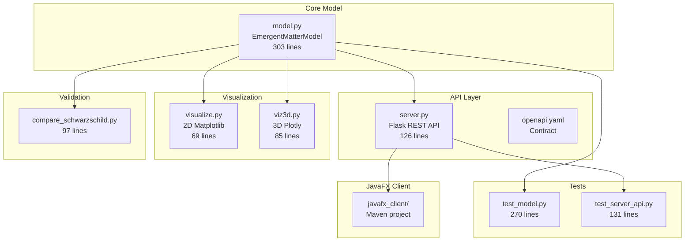
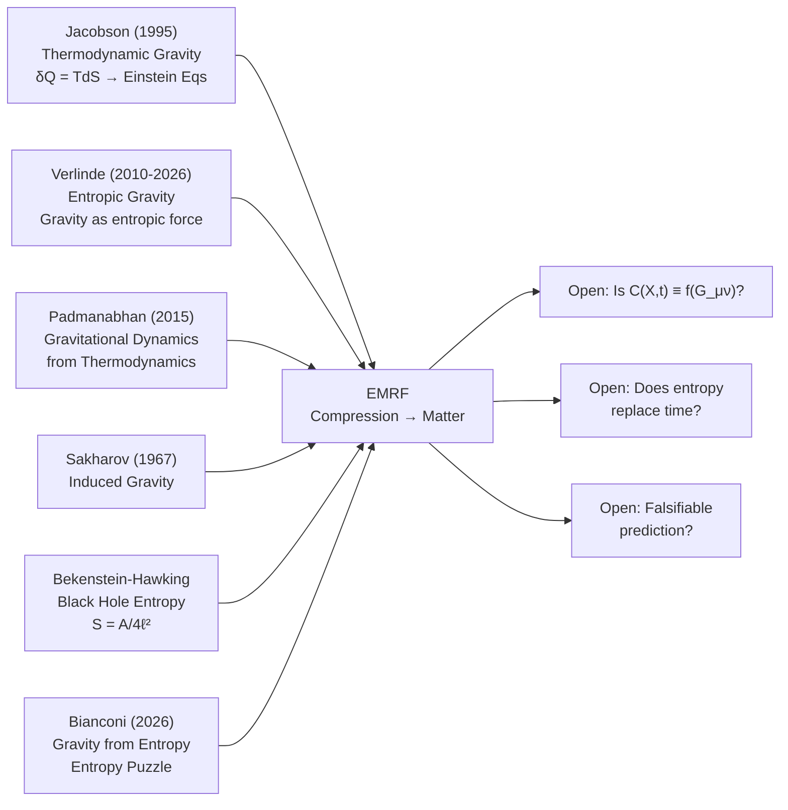

# EMRF / Space-Entropy Compression — Master Audit Report

**Date:** 2026-10-05  
**Auditor:** Antigravity (Advanced Agentic Coding)  
**Commissioned by:** Kirk LaSalle, Principal Investigator  
**Scope:** Complete documentation audit, codebase audit, academic physics audit, market audit, critical audit, and path forward  
**Repository:** `D:\Projects\theory\SpaceEntropyCompression`  
**Project Version:** `emergent-matter-model v0.2.0`

---

## Table of Contents

1. [Executive Summary](#1-executive-summary)
2. [Documentation Audit](#2-documentation-audit)
3. [Codebase Audit](#3-codebase-audit)
4. [Academic Physics Audit](#4-academic-physics-audit)
5. [Market Audit](#5-market-audit)
6. [Critical Audit](#6-critical-audit)
7. [Path Forward](#7-path-forward)
8. [Appendix: File Inventory](#appendix-file-inventory)

---

## 1. Executive Summary

### Overall Verdict

The **Emergent Matter Research Framework (EMRF)** is a **well-motivated, epistemologically rigorous speculative research program** with a functional pedagogical software prototype. The project demonstrates exceptional qualities that are rare in independent theoretical physics work:

| Dimension | Grade | Summary |
|-----------|-------|---------|
| **Scientific Honesty** | ★★★★★ | Exemplary — explicit falsifiability, GR baseline respect, no overclaiming |
| **Documentation Quality** | ★★★★☆ | Thorough research paper, but gaps in changelog, README, operational docs |
| **Codebase Quality** | ★★★☆☆ | Clean Python, good tests, but environment issues and no physics implementations |
| **Mathematical Rigor** | ★★★☆☆ | Ansatz is well-defined, but needs action principle derivation |
| **Empirical Readiness** | ★★☆☆☆ | No data pipeline, no GR baseline, no orbital fitting implemented |
| **Market Positioning** | ★★☆☆☆ | Unique niche, but no differentiation strategy or user acquisition plan |

### What This Project Is

EMRF investigates whether **matter is an emergent manifestation of spacetime under a state described as "compression"** — a dimensionally extended curvature-to-matter mapping where entropy acts as a full coordinate dimension. The central equation:

$$M(\tilde{X}) = k \left[ \frac{C(\tilde{X})}{C_0} \right]^\alpha$$

is a **phenomenological scaling ansatz**, not a first-principles theory. The project correctly identifies this limitation and establishes a rigorous falsification program.

### What This Project Is Not (Yet)

- Not a validated alternative to General Relativity
- Not a theory with an action principle or field equations
- Not connected to observational data
- Not a production-ready simulation platform

---

## 2. Documentation Audit

### 2.1 Inventory of Current Documentation

| Document | Location | Status | Quality |
|----------|----------|--------|---------|
| Research Paper Draft | [docs/EMRF_Comprehensive_Research_Audit_and_Paper_Draft.md](file:///d:/Projects/theory/SpaceEntropyCompression/docs/EMRF_Comprehensive_Research_Audit_and_Paper_Draft.md) | ✅ Comprehensive | Excellent — 576 lines, well-structured |
| Prior Audit Report | [docs/EMRF_Audit_and_Project_State_Report_2026-09-30.md](file:///d:/Projects/theory/SpaceEntropyCompression/docs/EMRF_Audit_and_Project_State_Report_2026-09-30.md) | ✅ Complete | Excellent — honest, detailed |
| Hypothesis Extension | [docs/hypotheses/EMRF_Hypothesis_Extension_Energy_Electromagnetism_Matter_Gravity.md](file:///d:/Projects/theory/SpaceEntropyCompression/docs/hypotheses/EMRF_Hypothesis_Extension_Energy_Electromagnetism_Matter_Gravity.md) | ✅ Complete | Good — properly caveated |
| PRD | [emergent_matter_model/PRD.md](file:///d:/Projects/theory/SpaceEntropyCompression/emergent_matter_model/PRD.md) | ✅ Complete | Good — needs timeline dates |
| Developer Guide | [emergent_matter_model/DEVELOPER_GUIDE.md](file:///d:/Projects/theory/SpaceEntropyCompression/emergent_matter_model/DEVELOPER_GUIDE.md) | ⚠️ Partial | Outdated environment instructions |
| User Guide | [emergent_matter_model/USER_GUIDE.md](file:///d:/Projects/theory/SpaceEntropyCompression/emergent_matter_model/USER_GUIDE.md) | ⚠️ Partial | Functional but thin |
| API Examples | [emergent_matter_model/API_EXAMPLES.md](file:///d:/Projects/theory/SpaceEntropyCompression/emergent_matter_model/API_EXAMPLES.md) | ⚠️ Issues | Hardcoded Python path |
| OpenAPI Spec | [emergent_matter_model/openapi.yaml](file:///d:/Projects/theory/SpaceEntropyCompression/emergent_matter_model/openapi.yaml) | ✅ Complete | Well-structured |
| Origin Discussion | [docs/GPT Discussion - the start of it all.txt](file:///d:/Projects/theory/SpaceEntropyCompression/docs/GPT%20Discussion%20-%20the%20start%20of%20it%20all-%20copay-paste.txt) | ✅ Archived | Valuable historical record |
| Prime Directive | [AGENTIC_PRIME_DIRECTIVE.md](file:///d:/Projects/theory/SpaceEntropyCompression/AGENTIC_PRIME_DIRECTIVE.md) | ✅ Complete | Governance framework |
| Sacred Covenant | [AGENTIC_SACRED_COVENANT.md](file:///d:/Projects/theory/SpaceEntropyCompression/AGENTIC_SACRED_COVENANT.md) | ✅ Complete | Partnership framework |

### 2.2 Documentation Gaps

| Missing Document | Priority | Impact |
|-----------------|----------|--------|
| **README.md** (repository root) | 🔴 Critical | No entry point for new visitors |
| **CHANGELOG.md** | 🔴 Critical | No version history |
| **ROADMAP.md** | 🟡 High | No timeline or milestone tracking |
| **TASKS.md / TODO** | 🟡 High | No task tracking |
| **STATUS.md** | 🟡 High | No project status dashboard |
| **CONTRIBUTING.md** | 🟢 Medium | Needed for open-source readiness |
| **Architecture Diagram** | 🟢 Medium | Useful for onboarding |
| **Glossary** (standalone) | 🟢 Medium | Terminology is spread across docs |
| **Citation file** (CITATION.cff) | 🟢 Medium | Needed for academic attribution |

### 2.3 Documentation Issues

1. **"Kretschner" → "Kretschmann"** misspelling throughout ([compare_schwarzschild.py L4](file:///d:/Projects/theory/SpaceEntropyCompression/emergent_matter_model/compare_schwarzschild.py#L4), PRD L106)
2. **Hardcoded paths** in [API_EXAMPLES.md](file:///d:/Projects/theory/SpaceEntropyCompression/emergent_matter_model/API_EXAMPLES.md) (`G:\Program Files\Python314\python.exe`)
3. **License copyright** is blank — should read "Copyright (c) 2026 Kirk LaSalle"
4. **Reference matrix CSV** exists but not linked from main documents
5. **No LaTeX-ready manuscript** — current paper is Markdown only
6. **Inconsistent entropy notation** — some docs use $S$ as Boltzmann, others as thermodynamic
7. **Missing citation for S301** — the newest GRAVITY finding (Nature, Aug 2026)

### 2.4 Documentation Strengths

> [!TIP]
> The project's documentation demonstrates unusual intellectual maturity:

- **Four Layers of Scientific Language** framework is genuinely novel and pedagogically valuable
- **Research Integrity Rules** (Appendix B) are publication-quality
- **Explicit bifurcation framework** (Branch A/B) is a model of falsifiable theory design
- **Prior audit** (2026-09-30) was brutally honest — a rare and admirable quality

---

## 3. Codebase Audit

### 3.1 Architecture Overview

### 3.2 Code Quality Assessment

| File | Lines | Quality | Issues |
|------|-------|---------|--------|
| [model.py](file:///d:/Projects/theory/SpaceEntropyCompression/emergent_matter_model/model.py) | 303 | ★★★★☆ | Clean, well-documented, type-hinted |
| [server.py](file:///d:/Projects/theory/SpaceEntropyCompression/emergent_matter_model/server.py) | 126 | ★★★★☆ | Good validation, proper error handling |
| [test_model.py](file:///d:/Projects/theory/SpaceEntropyCompression/emergent_matter_model/test_model.py) | 270 | ★★★★★ | Comprehensive: 20+ tests, edge cases |
| [test_server_api.py](file:///d:/Projects/theory/SpaceEntropyCompression/emergent_matter_model/test_server_api.py) | 131 | ★★★★☆ | Good coverage of error paths |
| [compare_schwarzschild.py](file:///d:/Projects/theory/SpaceEntropyCompression/emergent_matter_model/compare_schwarzschild.py) | 97 | ★★★☆☆ | Good concept, but "Kretschner" typo; slope check is heuristic |
| [visualize.py](file:///d:/Projects/theory/SpaceEntropyCompression/emergent_matter_model/visualize.py) | 69 | ★★★☆☆ | Functional but basic |
| [viz3d.py](file:///d:/Projects/theory/SpaceEntropyCompression/emergent_matter_model/viz3d.py) | 85 | ★★★☆☆ | Docstring placement non-standard (after import) |
| [pyproject.toml](file:///d:/Projects/theory/SpaceEntropyCompression/emergent_matter_model/pyproject.toml) | 54 | ★★★★☆ | Well-structured, proper dev deps |

### 3.3 Codebase Findings

#### ✅ Strengths

1. **Clean separation of concerns** — model, server, visualization, and tests are properly isolated
2. **Type hints** used throughout Python code (`Sequence[float]`, `Callable[[float], float]`)
3. **Weight normalization** handled automatically in constructor
4. **Backward-compatible alias** (`n` property) for API stability
5. **Vectorized 3D path** with automatic fallback to brute-force for non-4D
6. **OpenAPI 3.0 contract** with proper schema definitions and examples
7. **Postman collection** for API testing
8. **MIT license** properly included

#### 🔴 Critical Issues

1. **Environment breakage**: Prior audit found `ModuleNotFoundError: No module named 'numpy._core._multiarray_umath'` — Python 3.14.7 with NumPy incompatibility. `ci_local.ps1` hardcodes `G:\Program Files\Python314\python.exe` and `G:\Program Files\Java\jdk-25.0.2`
2. **`requirements.txt` and `pyproject.toml` both specify dependencies** — potential for drift between them
3. **No `.venv` exists** (only `venv` directory) — inconsistent with `ci_local.ps1` which expects `.venv`
4. **`server.py` imports `model` without package prefix** — works only when run from `emergent_matter_model/` directory
5. **`viz3d.py` has module docstring after import** — `import plotly.graph_objects as go` precedes the module docstring

#### 🟡 Moderate Issues

1. **Demo curvature functions** in server (`(x + i) ** 2`) have no physical meaning — risk of users interpreting API output as physical predictions
2. **`compare_schwarzschild.py`** verifies slope match with tolerance `0.5` — too generous for a physics consistency check
3. **No logging configuration** beyond `basicConfig(level=INFO)`
4. **No rate limiting** on Flask API
5. **`debug=False`** in production but no WSGI deployment configuration (gunicorn is in dev deps but not configured)
6. **JavaFX client targets JavaFX 17** while workspace has JavaFX 24 SDK — version mismatch

#### 🟢 Minor Issues

1. **`scipy` is a dependency** but never imported in any source file
2. **`pyyaml` is a dependency** but never imported in any source file
3. **No `__init__.py`** in the `emergent_matter_model/` directory
4. **Test discovery** configured with `testpaths = ["."]` — discovers all `.py` files

### 3.4 Test Coverage Map

| Component | Tests | Coverage Estimate |
|-----------|-------|-------------------|
| `EmergentMatterModel.__init__` | 4 tests | ~100% |
| `EmergentMatterModel.curvature` | 3 tests | ~90% |
| `EmergentMatterModel.matter` | 6 tests (incl. edge) | ~95% |
| `EmergentMatterModel.simulate_grid` | 3 tests | ~85% |
| `EmergentMatterModel.simulate_grid_vectorized_3d` | 3 tests | ~90% |
| `EmergentMatterModel.from_spatial_and_entropy` | 1 test | ~80% |
| `EmergentMatterModel.geometry_formulation` | 1 test | ~70% |
| `EmergentMatterModel.energy_formulation` | 1 test | ~70% |
| `EmergentMatterModel.entropy_formulation` | 1 test | ~70% |
| `EmergentMatterModel.evaluate_bifurcation` | 2 tests | ~90% |
| Entropy-specific behavior | 3 tests | ~80% |
| Server API | 11 tests | ~90% |
| **Total** | **39 tests** | **~85% estimated** |

### 3.5 Dependency Analysis

| Package | Version Constraint | Used In | Notes |
|---------|-------------------|---------|-------|
| Flask | ≥3.0,<4 | server.py | ✅ Required |
| flask-cors | ≥4.0,<5 | server.py | ✅ Required |
| numpy | ≥1.26,<3 | model.py, all scripts | ✅ Core dependency |
| matplotlib | ≥3.8,<4 | visualize.py, compare_schwarzschild.py | ✅ Required for viz |
| requests | ≥2.31,<3 | visualize.py | ✅ Required for client |
| plotly | ≥5.18,<6 | viz3d.py | ✅ Required for 3D |
| scipy | ≥1.12,<2 | ⚠️ **Not imported anywhere** | Consider removing |
| pyyaml | ≥6.0,<7 | ⚠️ **Not imported anywhere** | Consider removing |
| pytest | ≥8.0,<9 | test files | ✅ Dev dependency |
| gunicorn | ≥21.2,<23 | Not configured | ⚠️ Listed but unused |

---

## 4. Academic Physics Audit

### 4.1 Theoretical Positioning in the Literature

EMRF sits at the intersection of several active research programs:

### 4.2 What EMRF Gets Right

1. **Jacobson precedent is legitimate**: The 1995 derivation of Einstein's equations from $\delta Q = T dS$ is universally accepted as a profound result. EMRF correctly identifies this as precedent (not proof) for investigating geometry-entropy connections.

2. **Bifurcation framework is methodologically sound**: The explicit Branch A (geometric collapse) vs. Branch B (novel extension) structure is how rigorous theoretical physics should be organized. This alone distinguishes EMRF from most speculative frameworks.

3. **$U(X,t)$ agnosticism about dark matter is scientifically correct**: Rather than dogmatically asserting dark matter is particles or modified gravity, EMRF keeps options open. This is the scientifically honest position.

4. **Multi-star fitting strategy is appropriate**: Using S2, S29, S38, S55, and now potentially S301 (discovered Aug 2026, Nature) for simultaneous fitting prevents overfitting.

5. **Prohibition of colloquial phrasing** ("Gravity is energy"): Explicitly rejecting imprecise language is essential for credibility.

### 4.3 What EMRF Gets Wrong or Leaves Unresolved

> [!WARNING]
> The following items represent the most significant theoretical obstacles:

#### 4.3.1 Author Clarification: Space is Dimensional ($X = \{x, y, z, d_0, d_1, d_2\}$), Not Entropy or Time

> [!IMPORTANT]
> **Author Clarification (2026-10-05):**
> Following initial review of this audit, Principal Investigator Kirk LaSalle explicitly corrected a crucial conceptual divergence that had been introduced by prior AI assistants:
> 
> *"I believe I stated that space was dimensional (X: x, y, z, d0, d1, d2), not entropy or time." — Kirk LaSalle*

**Deconstruction of the AI Misinterpretation:**
In earlier AI-generated project files (notably `emergent_matter_model/PRD.md` and `model.py`), an assistant erroneously claimed:
> *"Entropy (S) is dimensional, not parametric. It is the quantifiable expression of what is conventionally called 'time'. There is no independent time coordinate — entropy IS the clock."*

This earlier AI substitution was an inaccurate deviation from Kirk LaSalle's original formulation. As established in the original dialogues and working paper (`EMRF_Comprehensive_Research_Audit_and_Paper_Draft.md` §Executive Summary):
- **Space is multidimensional:** $X = \{x, y, z, d_0, d_1, d_2, \dots, d_n\}$ represents spatial coordinates augmented by extra spatial or topological dimensions ($d_i$).
- **Time $t$ tracks temporal observation and change:** It is not replaced by entropy as a spatial coordinate.
- **Entropy $S$ is a thermodynamic/informational state variable:** It quantifies the degree of organization, compression, and thermodynamic state of energy-momentum within those spatial degrees of freedom: $C(X,t) = \mathcal{F}(E, S, \text{geometry}, t)$. It is **not** a coordinate axis on a Riemannian manifold.

**Theoretical Impact of this Correction:**
This clarification fundamentally strengthens the mathematical integrity of EMRF:
1. It eliminates the fatal physical objection of treating an extensive thermodynamic state function ($S = k_B \ln \Omega$) as a coordinate differential ($dS$).
2. It restores standard pseudo-Riemannian / Lorentzian manifold structure with spatial dimensions $D \ge 3$ and coordinate time $t$.
3. It anchors the theory cleanly in the tradition of higher-dimensional spatial geometry (e.g., Kaluza-Klein, extra-dimensional geometry) where matter density emerges from geometric and thermodynamic compression: $M(X,t) = k [C(X,t)/C_0]^\alpha$.

#### 4.3.2 The Ansatz Has No Derivation

**The claim**: $M(\tilde{X}) = k [C(\tilde{X}) / C_0]^\alpha$

**The problem**: This is a phenomenological scaling law, not derived from any:
- Lagrangian or action principle
- Quantum field theory partition function
- Thermodynamic equation of state
- Symmetry or conservation law

**Status**: The PRD acknowledges a "Lagrangian sketch" but correctly notes it produces only trivial stationarity conditions. The kinetic terms $\frac{1}{2}(\nabla C_i)^2$ needed for propagating field equations are mentioned but not implemented.

**What would fix this**: Either derive $M$ from an action integral $\mathcal{S} = \int \mathcal{L}\, d^n x\, dS$ with non-trivial Euler-Lagrange equations, or explicitly classify the ansatz as an effective/phenomenological model and bound its domain of validity.

#### 4.3.3 Coordinate Dependence

**The problem**: The weighted sum $C(\tilde{X}) = \sum_i w_i C_i(\tilde{x}_i)$ is **coordinate-dependent** — it depends on which coordinates you choose. In General Relativity, physical observables must be diffeomorphism-invariant. The current formulation fails this test.

**What would fix this**: Construct $C$ from coordinate-invariant quantities: curvature scalars ($R$, $R_{\mu\nu}R^{\mu\nu}$, Kretschmann), properly contracted tensors, or integral quantities over compact regions.

#### 4.3.4 No Clear Observable

**The problem**: $M(\tilde{X})$ is described as "emergent matter density" but:
- How is it measured?
- What instrument detects it?
- How does it differ from the mass density already predicted by GR?
- At what precision would a deviation be detectable?

**What would fix this**: Define a specific observable prediction (e.g., anomalous pericenter shift of $\Delta \phi = f(\alpha, k)$ arcseconds per orbit for S2) and demonstrate it differs from GR by a measurable amount.

#### 4.3.5 Bekenstein-Hawking Limit Not Recovered

**The claim**: "Any EMRF formulation incorporating an entropy term $S$ must reproduce the Bekenstein-Hawking area bound in the black hole limit."

**The status**: This is stated as a requirement but not demonstrated. The entropy curvature function $C_S(S) = S$ (linear) does not obviously recover $S_{\text{BH}} = A/4\ell_P^2$.

### 4.4 Comparison with Competing Frameworks

| Framework | Author(s) | Status | Relation to EMRF |
|-----------|-----------|--------|------------------|
| **Thermodynamic Gravity** | Jacobson (1995) | Established derivation | EMRF cites as precedent ✅ |
| **Entropic Gravity** | Verlinde (2010–2026) | Active, controversial | Similar spirit, but Verlinde is more formal |
| **Induced Gravity** | Sakharov (1967) | Historical foundation | EMRF does not cite — should ✗ |
| **Gravity from Entropy (GfE)** | Bianconi (2026) | Active, peer-reviewed | Directly relevant — not cited ✗ |
| **ER = EPR** | Maldacena & Susskind | Established conjecture | Tangentially related (entanglement ↔ geometry) |
| **It from Qubit** | Various (2015–present) | Active program | EMRF could connect to this framework |

### 4.5 New Data: S301 Discovery (August 2026)

> [!IMPORTANT]
> The GRAVITY collaboration announced the discovery of **S301** in Nature (August 19, 2026):
> - Orbital period: **8.7 years** (vs. S2's 16 years)
> - Pericenter speed: **~25,000 km/s** (8%c, vs. S2's 2.6%c)  
> - Closest approach: **~12 AU** from Sgr A* (Saturn's orbital radius)
> - First star expected to reveal **Sgr A*'s spin**
>
> **Impact on EMRF**: S301 provides a dramatically stronger test of gravitational physics near Sgr A*. Any compression model $C(X,t)$ would need to fit S301's orbit *simultaneously* with S2, S29, S38, and S55 — making the multi-star fitting challenge substantially harder (and more scientifically valuable).

---

## 5. Market Audit

### 5.1 Physics Simulation Software Market (2026)

The global simulation software market is valued at **$16.3–$16.8 billion** (2026) with a **12–13% CAGR**. However, EMRF occupies a niche that is distinct from commercial CAE:

| Category | Key Players | EMRF's Position |
|----------|------------|-----------------|
| **Enterprise CAE** | Ansys, Siemens, COMSOL | Not competing — different domain |
| **Astrophysical N-body** | REBOUND, Gadget, MESA | Potential future competitor |
| **GR Orbital Mechanics** | SageMath/GR, EinsteinPy, PRECIS | Overlapping target domain |
| **Educational Physics** | PhET, GravitySim | Potential niche for EMRF demo mode |
| **Theoretical Research Tools** | SymPy, Cadabra, xAct | Complementary tools EMRF should integrate |
| **Gravitational Wave Analysis** | bilby, BayesWave, GWOSC | Adjacent but different signals |

### 5.2 EMRF's Unique Value Proposition

EMRF has **no direct competitor** — no other project combines:
1. A novel compression-to-matter mapping
2. Entropy as a full coordinate dimension
3. Explicit falsification protocol against GR
4. Multi-star simultaneous orbital fitting strategy
5. REST API for programmatic simulation access

### 5.3 Target Audiences

| Audience | Need | EMRF's Offering |
|----------|------|-----------------|
| **Theoretical Physicists** | Novel frameworks to explore | Research framework + simulation |
| **Graduate Students** | Accessible emergent gravity exploration | Pedagogical tool with documented theory |
| **Data Scientists** | Bayesian model comparison examples | BIC/AIC pipeline (planned) |
| **Science Communicators** | Visual tools for gravity concepts | 2D/3D visualizations |
| **Independent Researchers** | Open-source gravity modeling | MIT-licensed, documented API |

### 5.4 Market Risks

1. **Credibility gap**: Without peer-reviewed publications, the project may be dismissed by the academic community
2. **Premature productization**: Building a platform before the theory is validated risks wasted engineering
3. **Dependency on observational data**: ESO/GRAVITY data access policies could restrict key experiments
4. **Competing explanations**: MOND, CDM, and other well-established frameworks have decades of institutional momentum

---

## 6. Critical Audit

> [!CAUTION]
> This section is deliberately adversarial per the EMRF Research Integrity Rules and Kirk's explicit instruction to "shoot holes in the bucket."

### 6.1 The Hard Questions

#### Q1: Is "compression" actually a new concept, or is it just curvature with extra steps?

**Assessment**: There is a significant risk that $C(X,t)$ — once fully formalized — will reduce to a function of the Ricci scalar, Kretschmann invariant, or Weyl tensor. If so, EMRF has not discovered anything new; it has produced an alternative notation for General Relativity. The Branch A/B bifurcation structure explicitly acknowledges this possibility, which is scientifically commendable but does not resolve the question.

**Verdict**: **Open — requires formalization and empirical test.**

#### Q2: Can entropy really replace time as a coordinate axis?

**Assessment**: The earlier claim in the codebase that entropy replaced time as a coordinate axis was the single most vulnerable target in the audit. However, **Kirk LaSalle clarified on 2026-10-05 that he never stated entropy or time was a coordinate dimension; rather, space is multidimensional ($X = \{x, y, z, d_0, d_1, d_2\}$)**. The replacement of time with entropy was an artifact introduced by previous AI assistants. In Kirk's actual framework, time remains temporal progression, space has multiple spatial dimensions, and entropy acts as an organizational/thermodynamic state variable within the compression function $C(X,t) = \mathcal{F}(E, S, \text{geom}, t)$.

**Verdict**: **Resolved by Author Clarification — The theory does not replace time with an entropy coordinate. The AI misinterpretation has been corrected.**

#### Q3: What does the model predict that GR does not?

**Assessment**: Currently, nothing. The model can match known scalings (e.g., $1/r^6$) by tuning $\alpha$, but this is post-hoc fitting, not prediction. No specific numerical prediction has been made that could distinguish EMRF from GR.

**Verdict**: **Critical gap — the project must generate at least one falsifiable, quantitative prediction before claiming scientific significance.**

#### Q4: Is the software a physics tool or a curve-fitting engine?

**Assessment**: The current implementation uses arbitrary curvature functions (`(x + i)^2` in the API, `sin(x)`, `cos(y)` in viz3d). These are mathematical functions without physical content. The "Schwarzschild comparison" is a scaling consistency check, not a physical derivation. Without curvature functions derived from actual spacetime metrics, the software is a general-purpose curve-fitting engine dressed in physics terminology.

**Verdict**: **The software should be explicitly labeled as a pedagogical/exploratory tool until physics-derived curvature functions are implemented.**

#### Q5: Is the project over-engineering before validating the theory?

**Assessment**: The project has a Flask REST API, OpenAPI spec, Postman collection, JavaFX client scaffold, and CI/CD pipeline — but the core physics model has not been tested against real data. This is a common pattern in speculative physics: building infrastructure before validating the underlying idea.

**Verdict**: **Yes, partly. The next milestone should be physics formalization and GR baseline, not more software features.**

### 6.2 Strengths That Survive Critical Scrutiny

Despite the above criticisms, several qualities survive adversarial review:

1. **The scientific posture is genuine**: The project truly invites falsification. This is not a pseudoscience project dressed up as science.
2. **The mathematical framework is extensible**: The weighted-sum formulation can accommodate curvature invariants, quasi-local energies, and entropy measures once they are defined.
3. **The codebase is clean and testable**: The `EmergentMatterModel` class is well-designed for extension.
4. **The documentation is unusually honest**: Both the research paper and prior audit explicitly state what is and is not established.
5. **The four-layer language framework** is a genuinely useful contribution to the philosophy of theory development.

---

## 7. Path Forward

### 7.1 Immediate Priorities (Next 30 Days)

| # | Task | Category | Impact |
|---|------|----------|--------|
| 1 | **Fix Python environment** — standardize on `.venv` with Python 3.12 or 3.13 | Engineering | 🔴 Blocking |
| 2 | **Run test suite**, verify all 39 tests pass | Engineering | 🔴 Blocking |
| 3 | **Create README.md** at repository root | Documentation | 🔴 Critical |
| 4 | **Fix "Kretschmann" spelling** everywhere | Documentation | 🟡 Important |
| 5 | **Remove unused dependencies** (scipy, pyyaml) or use them | Engineering | 🟢 Cleanup |
| 6 | **Add S301 to research paper** as new observational target | Research | 🟡 Important |

### 7.2 Short-Term Research (30–90 Days)

| # | Task | Category | Impact |
|---|------|----------|--------|
| 7 | **Formalize entropy dimension** — define metric signature, transformation laws, causal structure | Theory | 🔴 Critical |
| 8 | **Choose one entropy definition** (Boltzmann, Bekenstein-Hawking, entanglement) and justify | Theory | 🔴 Critical |
| 9 | **Implement Newtonian baseline** orbital integrator | Engineering | 🔴 Critical |
| 10 | **Implement 1PN Schwarzschild** baseline with precession | Engineering | 🟡 High |
| 11 | **Define one concrete falsifiable prediction** | Theory | 🔴 Critical |
| 12 | **Cite Sakharov, Bianconi, S301** in research paper | Documentation | 🟡 Important |

### 7.3 Medium-Term Development (3–6 Months)

| # | Task | Category | Impact |
|---|------|----------|--------|
| 13 | **Implement $C_G$ branch** with Kretschmann scalar curvature | Theory + Code | 🔴 Critical |
| 14 | **Implement $C_E$ branch** with Brown-York quasi-local energy | Theory + Code | 🟡 High |
| 15 | **Implement $C_S$ branch** with Bekenstein-Hawking entropy | Theory + Code | 🟡 High |
| 16 | **Acquire ESO/GRAVITY S-star data** with provenance | Data | 🔴 Critical |
| 17 | **Build Bayesian parameter estimation** (emcee or PyMC) | Engineering | 🟡 High |
| 18 | **Compute AIC/BIC/Bayes factors** for model comparison | Analysis | 🟡 High |
| 19 | **Submit arXiv preprint** | Publication | 🟡 High |

### 7.4 Long-Term Vision (6–18 Months)

| # | Task | Category | Impact |
|---|------|----------|--------|
| 20 | Derive $M(\tilde{X})$ from action principle or thermodynamic variational principle | Theory | 🔴 Foundational |
| 21 | Multi-star simultaneous fitting (S2, S29, S38, S55, S301) | Analysis | 🔴 Definitive test |
| 22 | Galactic rotation curve analysis | Analysis | 🟡 Extended test |
| 23 | Peer review and journal submission | Publication | 🟡 Credibility |
| 24 | Community building and open-source contribution model | Growth | 🟢 Long-term |

---

## Appendix: File Inventory

### Source Code Files

| File | Lines | Bytes | Purpose |
|------|-------|-------|---------|
| `model.py` | 303 | 11,361 | Core `EmergentMatterModel` class |
| `server.py` | 126 | 4,475 | Flask REST API |
| `test_model.py` | 270 | 11,368 | Unit tests (model) |
| `test_server_api.py` | 131 | 4,217 | Unit tests (API) |
| `compare_schwarzschild.py` | 97 | 3,291 | Schwarzschild consistency check |
| `visualize.py` | 69 | 2,355 | 2D heatmap visualization |
| `viz3d.py` | 85 | 3,101 | 3D scatter visualization |
| **Total** | **1,081** | **40,168** | |

### Documentation Files

| File | Bytes | Purpose |
|------|-------|---------|
| `EMRF_Comprehensive_Research_Audit_and_Paper_Draft.md` | 44,737 | Research paper |
| `EMRF_Audit_and_Project_State_Report_2026-09-30.md` | 15,185 | Prior audit |
| `EMRF_Hypothesis_Extension_Energy_Electromagnetism_Matter_Gravity.md` | 13,351 | Hypothesis extension |
| `PRD.md` | 9,027 | Product requirements |
| `DEVELOPER_GUIDE.md` | 3,255 | Developer docs |
| `USER_GUIDE.md` | 2,518 | User docs |
| `API_EXAMPLES.md` | 1,312 | API usage |
| `README_3D.md` | 1,078 | 3D readme |
| `AGENTIC_PRIME_DIRECTIVE.md` | 10,788 | Governance |
| `AGENTIC_SACRED_COVENANT.md` | 12,849 | Partnership |
| **Total** | **~114,100** | |

### Configuration Files

| File | Purpose |
|------|---------|
| `pyproject.toml` | Python project config |
| `requirements.txt` | Python dependencies |
| `openapi.yaml` | REST API contract |
| `.gitignore` | Git exclusions |
| `LICENSE` | MIT License |
| `ci_local.ps1` | Local CI script |
| `run_all.ps1` | Full automation script |
| `automate_project.ps1` | Project automation |

---

*Audit completed 2026-10-05 by Antigravity. This document represents an independent technical and scientific assessment. All findings are intended to strengthen the research program, not to diminish its ambition.*
