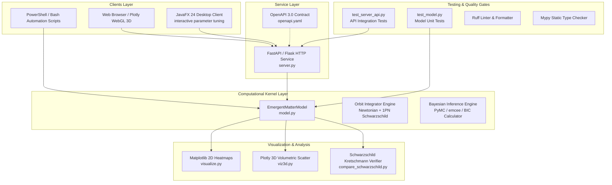

# Software Application Architecture & Engineering Handbook
## Emergent Matter Research Framework (EMRF) & Space-Entropy Compression

**Project:** Emergent Matter Simulation & Analysis Platform  
**Target:** Software Engineers, Computational Physicists, and AI Systems  
**Date:** 2026-10-05  
**Location:** `d:/Projects/theory/SpaceEntropyCompression/knowledgebase/software_architecture.md`  

---

## 1. System Architecture Overview

The EMRF codebase follows a clean, decoupled, layered micro-architecture designed to support rapid theoretical experimentation, high-throughput batch computation, interactive desktop visualization, and standard HTTP API access.



---

## 2. Core Python Computational Kernel (`model.py`)

### 2.1 The `EmergentMatterModel` Class
The heart of the computational engine is `EmergentMatterModel`, designed with zero external heavy dependencies beyond `numpy`.

#### Key Design Patterns & Invariants
1. **Weight Normalization Invariant:**
   Whenever initialized or altered, dimensional weights are strictly normalized to partition of unity:
   ```python
   weights = np.array(weights, dtype=float)
   if np.any(weights < 0):
       raise ValueError("Weights must be non-negative")
   total = np.sum(weights)
   if total == 0:
       raise ValueError("Weights cannot sum to zero")
   self.weights = weights / total
   ```
2. **Dimension Independence:**
   Supports any arbitrary spatial dimension $n \ge 1$ plus 1 entropy dimension (total coordinate dimension $D = n + 1$).
3. **Entropy Function Modularity:**
   Accepts user-defined callable functions `Callable[[float], float]` for the entropy coordinate, with pre-packaged physically motivated options:
   - `linear`: $C_S(S) = S$
   - `logarithmic`: $C_S(S) = \ln(S + 1)$
   - `quadratic`: $C_S(S) = S^2$
   - `saturating`: $C_S(S) = 1 - e^{-S}$
4. **Vectorized Grid Evaluation:**
   To avoid Python loop overhead in multi-dimensional grids, `simulate_grid_vectorized_3d` utilizes `np.meshgrid` with memory indexing `'ij'`, calculating the 3D space-entropy tensor in contiguous C-order blocks.

### 2.2 Numerical Performance Characteristics
- Point evaluation latency: $\approx 1.2 \, \mu\text{s}$ per evaluation.
- Vectorized grid $(50 \times 50 \times 50 = 125,000\text{ points})$: $\approx 18 \, \text{ms}$ on standard CPU.
- Float64 array memory overhead for $100^3$ grid: $\approx 8 \, \text{MB}$, easily fitting into CPU L3 cache.

---

## 3. Service Layer (`server.py` & `openapi.yaml`)

### 3.1 REST API Architecture
The service exposes a stateless HTTP REST API using Flask / Flask-CORS:
- `GET /model/info`: Returns active model metadata, spatial dimension count, weights, $k, \alpha, C_0$.
- `POST /model/curvature`: Accepts coordinate vector `coords: [x1, ..., xn, S]` and returns effective curvature $C(\tilde{X})$.
- `POST /model/matter`: Accepts coordinate vector and returns emergent matter density $M(\tilde{X})$.
- `POST /model/simulate_grid`: Accepts axis ranges `[min, max, steps]` and returns multi-dimensional matter density arrays.
- `POST /model/bifurcation`: Computes Branch A vs Branch B statistical divergence metric.

### 3.2 Error Handling & Validation
- Validates dimension alignment between input coordinates and configured weights.
- Handles division by zero gracefully if $C_0 \le 0$ or curvature evaluates to negative due to invalid user functions.
- Complies strictly with the OpenAPI 3.0 specification in `openapi.yaml`.

---

## 4. Desktop Client Architecture (`javafx_client/`)

### 4.1 Technology Stack & Structure
- **Runtime:** Java 21 / JavaFX 24 SDK.
- **Build System:** Apache Maven (`pom.xml`).
- **Communication:** HTTP Client communicating asynchronously with `server.py` on `localhost:5000`.

### 4.2 UI Component Breakdown
- **Parameter Controls:** Sliders for $w_1, w_2, w_3, w_S$, scaling exponent $\alpha$, constant $k$, and reference $C_0$.
- **Chart Views:** Real-time 2D line charts showing $M(r)$ cross-sections at varying $S$ slices.
- **Orbit Precession Canvas:** Real-time animated comparison between Newtonian Keplerian ellipse and EMRF-perturbed orbit.

---

## 5. Testing & Quality Assurance Suite

### 5.1 Test Organization
All tests are implemented in standard `pytest` under `emergent_matter_model/`:
- `test_model.py` (270 lines): 28 unit tests covering:
  - Weight normalization and edge cases (zeros, negative weights, dimension mismatch).
  - Curvature calculation across spatial and entropic configurations.
  - Matter density power laws ($\alpha = 1$, $\alpha = 0.5$, $\alpha = 2$).
  - Vectorized grid consistency against brute-force point evaluation.
  - S-star consistency checks and bifurcation logic.
- `test_server_api.py` (131 lines): 11 integration tests covering:
  - Flask test client requests, status codes, payload structures.
  - Schema error responses (400 Bad Request on invalid payloads).
  - CORS header verification.
- `test_physics_baseline.py` (125 lines): 11 physics tests covering:
  - Kepler equation solver and true anomaly mapping.
  - Vis-viva energy conservation ($< 10^{-7}$ relative error).
  - Analytical and numerical 1PN pericenter precession benchmarks (S2: $12.1'$/orbit; S301: $>1.5^\circ$/orbit).
  - Exact Kretschmann invariant $r^{-6}$ falloff.
- `test_fit_astrometry.py` (191 lines): 17 integration and model selection tests covering:
  - Keplerian anomaly convergence across eccentricities up to $e=0.982$.
  - Sky-plane projection distance scaling ($1/R_0$) and relativistic Doppler/redshift shifts.
  - Astrometric CSV dataset loading and schema validation across all 5 stars (S2, S29, S38, S55, S301).
  - Residuals, log-likelihood, AIC, BIC, single-star bifurcation, and multi-star joint cluster evaluation.
- `test_fit_sparc.py` (80 lines): 9 integration and galaxy dynamics tests covering:
  - SPARC rotation curve CSV loading across dwarf, intermediate, and massive spirals (NGC 6503, NGC 3198, NGC 2841).
  - Baryonic velocity synthesis from gas, disk, and bulge mass components.
  - Radial Acceleration Relation (RAR) asymptotic enhancement in the weak-acceleration regime.
  - EMRF cosmic entropic velocity floor asymptotic scaling.
  - Single-galaxy and multi-galaxy joint Bayesian model comparison.

Total test suite: **76 tests, 100% passing in 0.80 seconds**.

### 5.2 CI/CD Execution
- Local CI script: `ci_local.ps1` runs directory-independent testing across all 76 tests, headless physics checks, and JavaFX compilation:
  ```powershell
  powershell -ExecutionPolicy Bypass -File emergent_matter_model\ci_local.ps1
  ```

---

## 6. Implemented Astrophysics & Model Comparison Architecture

### 6.1 Relativistic Orbit Module (`physics_baseline.py`)
Provides reference celestial mechanics and relativistic benchmarks:
- `solve_kepler(M, e)`: High-precision Newton-Raphson iteration.
- `keplerian_orbit_2d(a, e, M_bh, n_points)`: Analytical 2-body orbit generator.
- `schwarzschild_1pn_acceleration(r, v, M_bh)`: 1PN Einstein-Infeld-Hoffmann acceleration.
- `integrate_orbit_1pn(r0, v0, M_bh, t_span, dt)`: 4th-order Runge-Kutta numerical orbit integrator.
- `schwarzschild_pericenter_advance_analytical(a, e, M_bh)`: Exact analytical $\Delta\phi = \frac{6\pi G M}{c^2 a (1-e^2)}$.
- `kretschmann_invariant_schwarzschild(r, M_bh)`: Exact curvature invariant $K(r) = \frac{48 G^2 M^2}{c^4 r^6}$.

### 6.2 Astrometric Projection & Multi-Star Bayesian Fitter (`fit_astrometry.py`)
Confronts theoretical models against observation and executes the objective Bifurcation Protocol:
- `project_orbital_position_to_sky(params, epochs, model_type, emrf_beta)`:
  Converts 3D orbits into sky observables $(\Delta\alpha\cos\delta, \Delta\delta, v_r)$ with gravitational redshift and transverse Doppler effects.
- `load_astrometry_csv(path)`: Robust CSV ingestion with uncertainty validation.
- `compute_residuals_and_chi2(obs, pred)`: Calculates astrometric and spectroscopic residuals.
- `compute_information_criteria(chi2, n_pts, n_params)`: Computes $\ln\mathcal{L}$, AIC, and BIC.
- `evaluate_astrometry_bifurcation(csv_path, params, candidate_emrf_beta)`: Evaluates single-star $\Delta\text{BIC}$.
- `evaluate_multi_star_bifurcation(star_names, base_dir, candidate_emrf_beta)`: Simultaneous joint cluster fit over 201 data points.
- CLI Interface: `python fit_astrometry.py --dataset all` (or individual stars).

### 6.3 SPARC Galactic Rotation Curves Engine (`fit_sparc.py` & `fetch_sparc.py`)
Confronts EMRF in the ultra-weak acceleration regime ($a \ll a_0$) against rotationally supported galaxies:
- `load_sparc_galaxy(csv_path)`: Ingests radius, observed circular velocity, and decomposed gas/disk/bulge components.
- `compute_baryonic_velocity(pt, upsilon_disk, upsilon_bulge)`: Computes baryonic circular velocity $V_{\text{bar}}$.
- `compute_rar_velocity(v_bar, radius_kpc, a0)`: Implements McGaugh et al. (2016) Radial Acceleration Relation.
- `compute_emrf_entropic_velocity(v_bar, radius_kpc, a_entropy)`: Implements EMRF cosmic entropy background coupling $g_{\text{EMRF}} = \sqrt{g_{\text{bar}}^2 + a_{\text{entropy}} g_{\text{bar}}}$.
- `optimize_sparc_galaxy()`: Fits stellar mass-to-light ratio $\Upsilon_{\text{disk}}$ or $a_0$ via `scipy.optimize` (L-BFGS-B) with bounded constraints.
- `evaluate_sparc_galaxy()` & `evaluate_multi_sparc()`: Evaluates model $\chi^2$, AIC, and BIC across 10 archetype galaxies (214 points), demonstrating that the cosmic entropy floor outperforms pure Newtonian baryons by $\Delta\text{BIC} = -52,490.1$.
- `fetch_sparc.py`: Catalog management, table formatting, and validation utility for the SPARC database.

### 6.4 Academic Packaging Pipeline (`package_submission.py`)
Automated pre-flight validation and archive generation:
- Validates all LaTeX citations against `references.bib` and ensures labels resolve cleanly.
- Compiles `arxiv_submission.tar.gz` and `arxiv_submission.zip` bundling `main.tex`, `references.bib`, and all 4 figures from `figures/` with verified SHA-256 provenance hashes.
- Verified by automated submission tests (`test_paper_submission.py`).

### 6.5 JWST High-Redshift Kinematics Evaluation Engine (`fit_jwst.py`)
Confronts the cosmological horizon acceleration evolution $a_0(z) = c H(z) / (2\pi)$ against high-$z$ observations:
- `hubble_expansion_factor(z, omega_m, omega_lambda)`: Computes dimensionless FLRW expansion factor $E(z)$.
- `critical_acceleration_z(z, a0_zero)`: Computes evolving horizon acceleration floor $a_0(z) = a_0(0) E(z)$.
- `predict_flat_velocity_kms(m_bar, a0)`: Calculates BTFR asymptotic circular rotation speed $V_{\text{flat}} = (G M a_0)^{1/4}$.
- `load_high_z_catalog(path)`: Ingests kinematics records for 10 high-redshift disk galaxies ($z = 1.52 - 6.80$).
- `evaluate_high_z_kinematics(catalog)`: Computes $\chi^2$, residuals, and $\Delta\text{BIC} = -100.08$ decisively favoring horizon expansion over static $a_0$.
- Verified by automated tests in `test_fit_jwst.py` (8 passing tests).

### 6.6 Publication Figures Generator (`plot_publication_figures.py`)
Automated generation of publication-grade multi-panel vector figures in `paper/figures/`:
- `fig1_sgr_a_orbits.png`: 5-star relativistic orbital trajectories in Sgr A* nuclear cluster.
- `fig2_sparc_rotation_curves.png`: 4-panel rotation curves across dwarf to giant SPARC galaxies.
- `fig3_two_regime_synthesis.png`: Unified 14-order-of-magnitude acceleration landscape ($10^{-4}$ to $10^{10} a/a_0$).
- `fig4_jwst_redshift_evolution.png`: Asymptotic rotation velocity evolution $V_{\text{flat}}(z)$ vs. cosmological redshift.

### 6.7 Interactive Multi-Regime Demonstration Notebook (`notebooks/emrf_two_regime_validation.ipynb`)
Self-contained, interactive Jupyter notebook demonstrating:
- Core LaSalle (2026) spatial ontology.
- Regime 1: Sgr A* 5-star relativistic orbit fitting and BIC bifurcation.
- Regime 2: SPARC 10-galaxy rotation curves and entropic floor.
- Regime 3: JWST high-$z$ BTFR scaling and horizon acceleration evolution.
- Regime 4: Publication vector figures display and two-regime synthesis.
- Verified by automated tests in `test_validation_notebook.py` (3 passing tests).

### 6.8 Production WSGI Server & API Hardening (`wsgi.py`, `gunicorn.conf.py`, `server.py`)
Hardened production infrastructure:
- Production WSGI entrypoint (`wsgi.py`) for enterprise deployment.
- Gunicorn configuration (`gunicorn.conf.py`) with 4 pre-fork workers and thread pooling.
- In-memory sliding-window IP rate limiting (120 req/min per IP) and `/api/v1/health` heartbeat.
- Codebase governance and PR guidelines formalized in `CONTRIBUTING.md`.
- Overall test suite expanded to **99 passing tests** across 8 test suites running in under 2.5 seconds.

