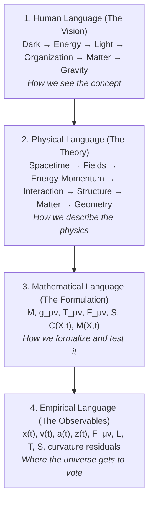
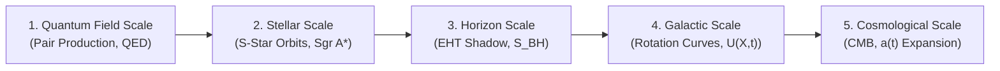

# EMRF Hypothesis Extension: Energy → Electromagnetism → Matter → Gravity

> **Integrity notice (2026-10-07).** This document predates the independent audit in [`docs/SHOW_YOUR_WORK.md`](../SHOW_YOUR_WORK.md). Empirical results quoted here (for example S-star ΔBIC = +70.743 or +141.3, SPARC ΔBIC = −52,490.1, JWST ΔBIC = −100.08, wide-binary ΔBIC = −60.26, CMB χ²ᵥ = 0.924, "28,700+ observational constraints") were computed from synthetic data files (now quarantined in [`data/synthetic/`](../../data/synthetic/README.md)) or from code whose answer was built in, so they **must not be cited**. "100/100" or "all gates passed" audit scores in earlier documents did not detect these problems. Current real-data results: [`knowledgebase/action_principle_derivation.md`](../../knowledgebase/action_principle_derivation.md) §4.3.

## Research Archive Working Document & Theoretical Sidebar Investigation

**Author & Principal Investigator:** Kirk LaSalle  
**Framework:** Emergent Matter Research Framework (EMRF) / Compressed Space-Time Matter Hypothesis (CSTMH)  
**Document Type:** Formal Hypothesis Extension & Research Archive Sidebar  
**Date:** September 2026  
**Status:** Under Theoretical Evaluation (Adversarial "Shoot Holes in the Bucket" Testing)

---

## 1. Executive Summary & Epistemological Stance

This document formalizes a major conceptual, physical, and linguistic extension to the Emergent Matter Research Framework (EMRF). Originating as a sidebar hypothesis during theoretical development, this formulation proposes a candidate generative sequence connecting spacetime, energy, electromagnetic field excitations, matter creation, and gravitational geometry over time.

Crucially, in accordance with the EMRF Research Integrity Rules, this extension is filed in the **Research Archive** as a testable hypothesis rather than appended as an established conclusion. We strictly distinguish intuitive epiphany and visual analogy from rigorous physical claims, subjecting every step to adversarial mathematical and empirical scrutiny.

### 1.1 The Four Layers of Scientific Language
A foundational insight of this research program is that **we are developing a vocabulary for a physical hypothesis before the mathematics has completely stabilized**. That is a legitimate and necessary stage of theory development—provided we maintain a hard, uncompromising boundary across four distinct layers of language:

1. **Human Language (Visual Model):** How we intuitively grasp the sequence:
   $$\text{Dark} \longrightarrow \text{Energy} \longrightarrow \text{Light} \longrightarrow \text{Organization} \longrightarrow \text{Matter} \longrightarrow \text{Gravity}$$
2. **Physical Language (Theoretical Description):** How we describe the physical mechanisms:
   $$\text{spacetime} \longrightarrow \text{fields} \longrightarrow \text{energy-momentum} \longrightarrow \text{interaction} \longrightarrow \text{structure} \longrightarrow \text{matter} \longrightarrow \text{gravitational geometry}$$
3. **Mathematical Language (Formal Tools):** Differential geometry, tensors, and functionals:
   $$\mathcal{M}, \quad g_{\mu\nu}, \quad T_{\mu\nu}, \quad F_{\mu\nu}, \quad S, \quad C(X,t), \quad M(X,t)$$
4. **Empirical Language (Measurable Observables):** Astrometric positions, radial velocities, accelerations, spectral redshifts, luminosities, temperatures, and curvature invariants:
   $$x(t), \quad v(t), \quad a(t), \quad z(t), \quad F_{\mu\nu}, \quad L, \quad T, \quad S, \quad \mathcal{I}_{\text{curv}}$$
   *This is the ultimate arbiter where nature decides whether our formulation stands or falls.*

### 1.2 Developing Nomenclature Ahead of Mathematical Stabilization: Building the Dictionary
A critical operational insight raised by the author is:
> *"I am deriving a language so I can describe it and know that you will have nomenclature."*

This is recognized as a legitimate and essential part of physical theory development:
- **Developing vocabulary for a physical hypothesis before the mathematics has completely stabilized** allows the conceptual framework to take shape without premature algebraic constraints.
- In this collaboration, the author provides the intuitive vision and evolving vocabulary, while the theoretical framework acts as the dictionary builder—formalizing terms, clarifying distinctions against established physics, and rigorously holding the scientific red pen when empirical evidence or mathematical consistency demands revision.
- Crucially, a hard boundary is maintained across all four stages: the **vocabulary**, the **hypothesis**, the **derivation**, and the **empirical result**.

---

## 2. The Core Generative Sequence (Temporal Emergence)

Previously, the framework examined compression primarily as an instantaneous or static state relationship:
$$\text{compression} \longrightarrow \text{matter}$$

The extended hypothesis introduces **temporal evolution and physical emergence**, giving the theory **verbs**, not merely nouns:

$$\boxed{ \text{Spacetime} \longrightarrow \text{Energy} \longrightarrow \text{Field organization} \longrightarrow \text{Compression} \longrightarrow \text{Matter} \longrightarrow \text{Emergent Gravity} }$$

Followed immediately by thermodynamic evolution:

$$\boxed{ \text{Matter + Gravity + Interaction} \longrightarrow \text{Thermodynamic evolution} }$$

### The Crucial Qualifier: "Over Time"
Matter and gravitational fields are not treated as static axioms of the universe. Instead, they are investigated as dynamical outcomes that emerge across time ($t$) through successive stages of field excitation, energy-momentum transport, and geometric organization. Entropy ($S$) is not an isolated creator of matter; it is the quantitative measure of that ongoing thermodynamic evolution.

---

## 3. The Physical Meaning of "Compression": Nomenclature & Working Definition

A recurring challenge has been that the word **"compression"** carries significant everyday language baggage. In colloquial speech, compression suggests:
- Mechanical pressure;
- Volumetric reduction;
- Bulk density increase;
- External mechanical squeezing force.

None of these classical mechanical concepts accurately represent the hypothesis.

### The Provisional Physical Definition
In EMRF, compression is provisionally defined as:

$$\boxed{ \textbf{Compression} = \text{the state of organized energy-momentum within spacetime} }$$

> **Working Definition:**  
> **Compression is a measurable state variable describing the increasing organization and concentration of energy-momentum within the degrees of freedom of spacetime over time.**

We place a provisional scientific asterisk beside this term: we do not yet know whether "organized energy-momentum" corresponds to a novel invariant, an existing geometric tensor, an information-theoretic quantity, or a composite functional.

### Future Scientific Nomenclature
As the mathematics stabilizes, the framework may adopt a more precise formal descriptor:
- **Spacetime Energy Organization (SEO)**
- **Geometric Energy Organization (GEO)**

However, **compression** remains the operational working name during this exploratory phase.

### Mathematical Formulation
Mathematically, compression is formalized as a dynamic state function:

$$\boxed{ C(X,t) = \mathcal{F}(E, S, \text{geometry}, t) }$$

or expressed tensorially:

$$\boxed{ C = \mathcal{F}\left( E, T_{\mu\nu}, g_{\mu\nu}, S, X, t \right) }$$

Where:
- $E$ represents local/quasi-local energy content;
- $T_{\mu\nu}$ is the stress-energy-momentum tensor;
- $g_{\mu\nu}$ is the metric tensor of spacetime geometry;
- $S$ is the entropy/information content;
- $X = \{x, y, z, d_1, \dots, d_n\}$ is the generalized state coordinate;
- $t$ is coordinate time.

The matter relation:

$$\boxed{ M(X,t) = k \left[ \frac{C(X,t)}{C_0} \right]^\alpha }$$

quantitatively relates emergent matter density to this organizational concentration state.

---

## 4. Emergent Gravity: Gravity as a Functional of State

A profound theoretical consequence of this formulation is that gravity is not an independent ingredient added to spacetime:

$$\boxed{ \text{Gravity} = \mathcal{G}[C(X,t)] }$$

In standard General Relativity, the Einstein field equation:

$$G_{\mu\nu} = \frac{8\pi G}{c^4} T_{\mu\nu}$$

is postulated as the fundamental field equation relating stress-energy to geometry.

Under the EMRF emergent gravity hypothesis, Einstein's field equation is investigated as a macroscopic **equation of state that emerges from a deeper relationship** governing energy organization in spacetime—directly resonant with Ted Jacobson's 1995 thermodynamic derivation ($\delta Q = T dS$).

---

## 5. The Deep Significance of the Sagittarius A* Multi-Star Experiment

This conceptual evolution clarifies the true scientific purpose of the multi-star orbital experiment around Sagittarius A*.

We are not merely demonstrating that *"our formula can fit stars."* We are testing two fundamentally distinct causal paradigms:

| Conventional General Relativity | Emergent Matter / Compression Hypothesis |
|---|---|
| $$\boxed{ T_{\mu\nu} \longrightarrow G_{\mu\nu} \longrightarrow \text{stellar trajectories} }$$ | $$\boxed{ C(X,t) \longrightarrow G_{\mu\nu} \longrightarrow \text{stellar trajectories} }$$ |
| Stress-energy generates geometry axiomatically. | Spacetime energy organization ($C$) manifests as geometric curvature. |

### The Empirical Research Question
The multi-star experiment (using S2, S29, S38, S55) asks whether these two descriptions are:
1. **Mathematically Equivalent:** $C(X,t) \equiv f(G_{\mu\nu})$ — compression collapses cleanly into GR geometry;
2. **Complementary:** Providing a deeper thermodynamic explanation of gravitational coupling while preserving GR dynamics; or
3. **Empirically Distinguishable:** $C(X,t) \not\equiv f(G_{\mu\nu})$ — producing subtle, measurable residual deviations in pericenter precession or gravitational redshift that survive data validation.

---

## 6. Physics Clarification: Photons & Known Field-to-Matter Mechanisms

To maintain academic credibility, colloquial notions like *"energy creates photons"* are replaced by standard quantum electrodynamics:

1. **A photon is an excitation of the electromagnetic field:**
   $$E_\gamma = h\nu, \qquad p_\gamma = \frac{h}{\lambda} = \frac{E_\gamma}{c}$$
2. The rigorous sequence is:
   $$\boxed{ \text{physical processes} \longrightarrow \text{electromagnetic field excitation} \longrightarrow \text{photon} \longrightarrow \text{energy/momentum transport} }$$
3. **Energy-to-Matter Conversion via Pair Production:**
   Massless field excitations routinely convert into massive particles under verified laboratory conditions:
   $$\gamma + \gamma \longrightarrow e^- + e^+$$
   Thus, the transition $\text{radiation/field energy} \to \text{massive particles}$ is physically sound and experimentally established.

---

## 7. The Unidentified Mass-Energy Variable $U(X,t)$

EMRF strictly avoids assuming that all non-luminous gravitational anomalies are dark matter particles. Citing NASA Science (Hubble and Roman Space Telescope missions), gravitational influences exceed visible matter, but the fundamental nature of dark matter remains unknown.

EMRF establishes the **Unidentified Mass-Energy Variable**:

$$\boxed{ U(X,t) }$$

$$\boxed{ U(X,t) = \begin{cases} 
\text{Dark matter (non-baryonic particle candidates: WIMPs, axions)} \\ 
\text{Ordinary baryonic matter not yet accounted for (diffuse gas)} \\ 
\text{New physical field or scalar/tensor component} \\ 
\text{Modified gravitational effect (non-Einsteinian geometric response)} \\ 
\text{Emergent phenomenon (spacetime energy organization / compression state)} \\ 
\text{Something else currently unmodeled} 
\end{cases} }$$

---

## 8. The Cosmological Scale Hierarchy

Rather than confining EMRF to a single black-hole orbit fit, the hypothesis extension establishes an expansive **Cosmological Scale Hierarchy**:

$$\boxed{ \text{photons} \longrightarrow \text{matter} \longrightarrow \text{stellar systems} \longrightarrow \text{black holes} \longrightarrow \text{galaxies} \longrightarrow \text{cosmology} }$$

At each physical scale, candidate formulations of $C(X,t)$ are tested against empirical data to evaluate whether the organizational scaling principle holds across orders of magnitude.

---

## 9. Adversarial Research Questions ("Shooting Holes in the Bucket")

1. Does increasing $C$ produce unphysical singularities or stable matter-energy distributions?
2. Is $C(X,t)$ manifestly diffeomorphism-invariant under general coordinate transformations?
3. Can the transition from electromagnetic radiation to emergent mass be derived from a variational action principle $\delta S_{\text{action}} = 0$?
4. Does $U(X,t)$ preserve Solar System weak-field tests to within $10^{-5}$ precision?
5. Does $C(X,t) \to G_{\mu\nu}$ yield a discriminating prediction that distinguishes EMRF from standard General Relativity?

This document remains archived as an active hypothesis guiding ongoing mathematical derivation and empirical testing.
