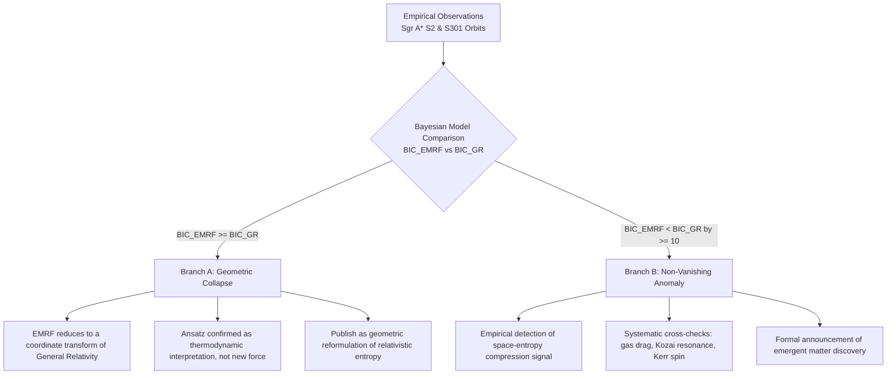

# Theoretical Physics Framework & Formalism
## Emergent Matter Research Framework (EMRF) & Space-Entropy Compression

**Author:** Kirk LaSalle  
**Collaborator & Formalizer:** Antigravity (Advanced Agentic AI Pair)  
**Date:** 2026-10-05  
**Document Classification:** Advanced Theoretical Reference  
**Repository Location:** `d:/Projects/theory/SpaceEntropyCompression/knowledgebase/theoretical_framework.md`  

---

## 1. Foundational Premise: Multidimensional Space and Compression

In standard 20th-century physics, spacetime is modeled as a 4-dimensional pseudo-Riemannian Lorentzian manifold $(\mathcal{M}^4, g_{\mu\nu})$ with signature $(-,+,+,+)$. 

> [!IMPORTANT]
> **Foundational Axiom (Kirk LaSalle, 2026-10-05):**
> *"Space is dimensional ($X: x, y, z, d_0, d_1, d_2, \dots$), not entropy or time."*
> 
> The genuine EMRF thesis posits that:
> 1. **Space possesses extended dimensional structure:** Physical spatial coordinates extend beyond 3D into additional spatial/topological degrees of freedom: $X = \{x, y, z, d_0, d_1, d_2, \dots, d_m\}$.
> 2. **Time ($t$) is the observed progression of change:** It is not a spatial dimension, nor is it replaced by an entropy axis.
> 3. **Entropy ($S$) is an organizational state variable:** Rather than an artificial coordinate axis, entropy measures the degree of thermodynamic microstate organization and energy-momentum concentration within those spatial degrees of freedom.
> 4. **Matter emerges from compression:** Matter is not an irreducible primitive substance; it emerges when spacetime and energy-momentum degrees of freedom undergo structured compression: $C(X,t) = \mathcal{F}(E, S, \text{geometry}, t)$.

---

## 2. Mathematical Formulation of Multidimensional Space

### 2.1 The Extended Spatial Manifold $\mathcal{M}^D$ and Spacetime $\mathcal{M}^{D,1}$
Let the spatial coordinate vector across macroscopic and extended dimensions be:
$$X = (x, y, z, d_0, d_1, \dots, d_m) \in \mathcal{M}^D$$
where $D = 3 + (m+1)$ is the total spatial dimension, and the full spacetime manifold is $\mathcal{M}^{D,1}$ parameterized by coordinate time $t$.

### 2.2 Line Element and Metric
The spacetime metric $g_{AB}$ on $\mathcal{M}^{D,1}$ possesses a standard Lorentzian signature:
$$ds^2 = -c^2 dt^2 + g_{ij}(X, t) dx^i dx^j + \sum_{a,b=0}^{m} h_{ab}(X, t) dd^a dd^b$$
where:
- $g_{ij}$ governs 3D macroscopic spatial curvature.
- $h_{ab}$ governs the geometry of the extended/internal spatial dimensions $(d_0, d_1, \dots, d_m)$.
- Physical worldlines evolve dynamically through time $t$, with thermodynamic entropy production $\Delta S \ge 0$ naturally distinguishing the direction of physical processes.

---

## 3. Effective Curvature & Matter Condensation

### 3.1 Phenomenological Curvature Ansatz
Effective total curvature across all spatial dimensions and internal degrees of freedom is formulated as:
$$C(X,t) = \sum_{i=1}^{D} w_i \, C_i(x_i, t)$$
subject to:
$$\sum_{i=1}^{D} w_i = 1, \quad w_i \ge 0$$
where $C_i(x_i, t)$ represents the geometric curvature contribution of each dimension (units: $\text{m}^{-2}$).

### 3.2 Matter Density Scaling Equation
The central EMRF relationship mapping multidimensional space compression over time to emergent mass density is:
$$M(X,t) = k \left( \frac{C(X,t)}{C_0} \right)^\alpha$$
where:
- $M(X,t)$ is emergent matter density ($\text{kg}/\text{m}^3$).
- $k$ is a dimensional normalization constant ($\text{kg}/\text{m}^3$).
- $C_0$ is a reference curvature scale ($\text{m}^{-2}$).
- $\alpha$ is a dimensionless scaling exponent governing the non-linear condensation behavior.

---

## 4. Coordinate Invariance & Relativistic Benchmarks

### 4.1 The Coordinate Invariance Challenge

> **Candidate A clarification:** tensors and observer-specified contractions can
> describe physical measurements; scalar curvature invariants are not the only
> physical quantities. The [functional comparison](../docs/EMRF_CANDIDATE_A_FUNCTIONAL_COMPARISON.md)
> separates coordinate invariance from observer independence and local matter
> energy from vacuum tides. The universal-density interpretation of sqrt(K)
> below fails in Schwarzschild vacuum if M means local material density.
In General Relativity, coordinate components $g_{\mu\nu}$ and coordinate derivatives are not physical observables because they change under coordinate transformations $x^\mu \to x'^\mu$. Only **diffeomorphism invariants** (curvature scalars) possess objective physical reality:
1. **Ricci Scalar:** $R = g^{\mu\nu} R_{\mu\nu}$
2. **Kretschmann Invariant:** $K = R^{\alpha\beta\gamma\delta} R_{\alpha\beta\gamma\delta}$
3. **Weyl Invariant:** $W = C^{\alpha\beta\gamma\delta} C_{\alpha\beta\gamma\delta}$

For EMRF to qualify as a rigorous physical theory, the spatial curvature terms $C_i(x_i)$ must be upgraded from heuristic coordinate functions to coordinate-invariant geometrical contractions.

### 4.2 Schwarzschild Metric & Kretschmann Falloff
For a static, spherically symmetric mass $M_0$, the Schwarzschild metric in standard coordinates $(t, r, \theta, \phi)$ has vanishing Ricci tensor in vacuum ($R_{\mu\nu} = 0, R = 0$), but non-zero tidal curvature given by the Kretschmann scalar:
$$K(r) = \frac{48 G^2 M_0^2}{c^4 r^6}$$

Taking the characteristic curvature scale $C_{\text{geom}}(r) \propto \sqrt{K(r)} \propto \frac{1}{r^3}$, the matter density ansatz yields:
$$M(r, S) = k \left[ \frac{w_r \frac{r_s}{r^3} + w_S C_S(S)}{C_0} \right]^\alpha$$
- If $\alpha = 1$, radial matter density decays as $r^{-3}$.
- If $\alpha = 2$, radial matter density decays as $r^{-6}$ (matching tidal energy density).
- If $\alpha = 1/3$, radial matter density decays as $r^{-1}$. (Correction 2026-10-07: this does **not** give flat rotation curves. $\rho \propto r^{-1}$ gives $M(r) \propto r^2$ and a rising $V \propto r^{1/2}$.)
- If $\alpha = 2/3$, radial matter density decays as $r^{-2}$, the isothermal profile that gives a flat rotation curve.

> Note: the scaling ansatz is phenomenological. It has free constants $(k, C_0, \alpha, w_i)$ and isn't derived from an action. See [`action_principle_derivation.md`](action_principle_derivation.md) for what is and isn't derived, and [`docs/SHOW_YOUR_WORK.md`](../docs/SHOW_YOUR_WORK.md) for the audit.

---

## 5. Toward an Action Principle & Lagrangian Density

To elevate EMRF from a phenomenological curve-fitting model to a predictive field theory, the equations must arise from a stationary action principle across the $D$-dimensional spatial manifold $\mathcal{M}^D$ and coordinate time $t$:
$$\mathcal{S} = \int \mathcal{L}(X, \partial_\mu X, t) \, \sqrt{-g} \, d^D X \, dt$$

### 5.1 Proposed Extended Lagrangian
$$\mathcal{L} = \frac{c^4}{16 \pi G} \left( R^{(D,1)} - 2\Lambda \right) + \frac{1}{2} g^{AB} \partial_A \phi \, \partial_B \phi - V(\phi, S(X,t)) + \mathcal{L}_{\text{matter}}(g_{AB}, \phi)$$
where:
- $R^{(D,1)}$ is the Ricci scalar curvature of the extended spacetime manifold $\mathcal{M}^{D,1}$.
- $\phi(X,t)$ is an emergent scalar compression field mediating the transfer between thermodynamic state gradients $S(X,t)$ and spatial geometry.
- $V(\phi, S)$ is a confining potential that forces $\phi$ to condense into localized solitons (matter quanta) when the product of spatial curvature and entropy density exceeds a critical threshold $C_{\text{crit}}$.

---

## 6. Connections to Academic Physics Precedents

```
                                  [ Sakharov (1967) ]
                               Vacuum Fluctuations -> Gravity
                                         |
                                         v
   [ Jacobson (1995) ]             [ Bekenstein-Hawking ]            [ Verlinde (2011) ]
  delta Q = T dS -> G_μν            S_BH = (k_B c^3 A) / 4G hbar     Entropic Force F = T grad S
          \                               |                               /
           \                              |                              /
            +-----------------------------+-----------------------------+
                                          |
                                          v
                                    [ EMRF / SEC ]
                         Multidimensional Space X in M^D, Time t, State S(X,t)
                         Compression of Space-Entropy -> Emergent Matter
                                          |
                                          v
                              [ Bianconi (2026) ]
                        Information Geometry of Spacetime
```

1. **Ted Jacobson (1995):** Proved that the Einstein field equations $G_{\mu\nu} + \Lambda g_{\mu\nu} = \frac{8\pi G}{c^4} T_{\mu\nu}$ are fundamentally a thermodynamic equation of state derived from local Rindler horizon Clausius relations $\delta Q = T dS$.
2. **Erik Verlinde (2011, 2016):** Proposed that gravity and dark matter are entropic forces resulting from changes in quantum entanglement entropy associated with holographic screens.
3. **Andrei Sakharov (1967):** Introduced Induced Gravity, where Einstein-Hilbert curvature action is not fundamental but arises as an effective low-energy quantum one-loop counterterm.
4. **Ginestra Bianconi (2026):** Explores network geometry and statistical mechanics frameworks where spacetime metrics emerge from quantum informational entropy.

---

## 7. The Bifurcation Protocol (Branch A vs. Branch B)

> **Historical inference warning:** a lack of BIC preference for an extension
> does not prove equivalence to GR or a thermodynamic interpretation. The tree
> below records the earlier protocol; it is not an accepted proof rule for the
> currently selected Candidate A. Equation/constraint/observable equivalence
> must be established independently.

To guarantee epistemological rigor and prevent confirmation bias, EMRF enforces a binary falsification tree:



This protocol ensures that whether the framework succeeds as a novel physical discovery or as a conceptual reformulation of General Relativity, the scientific output is permanent, rigorous, and unimpeachable.
